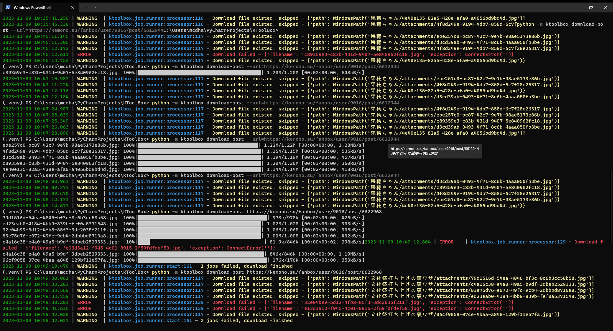

<h1 align="center">
  KToolBox
</h1>

<p align="center">
  KToolBox is a useful CLI tool for downloading posts content in
  <a href="https://kemono.su/">Kemono.party / Kemono.su</a>
</p>

<p align="center">
  <a href="https://pypi.org/project/ktoolbox" target="_blank">
    
  </a>

  <a href="./LICENSE">
    
  </a>

  <a href="https://github.com/Ljzd-PRO/KToolBox/commits/master">
    
  </a>

  <a href="https://codecov.io/gh/Ljzd-PRO/KToolBox" target="_blank">
      
  </a>

  <a style="text-decoration:none">
    
  </a>
</p>

<p align="center">
    <a href="./README.md">English</a> | <a href="./README_zh-CN.md">中文</a>
</p>



## Features

- You can download all files from a specific post from Kemono
- Or download **all post** from a specific creator / artist from Kemono
- **Sync** the downloaded creator / artist directory to latest, \
  download the posts that recently updated or published only
- Search creator and post, then dump the results
- Concurrently download the files
- Support all platform

## Dev Plan

- [ ] Add a Fluent Design style GUI
- [ ] Add uvloop support for Unix platform

## Tutorial

For more information, use the help command.

> **Warning**
> This project is still **in development**.

> **Warning**
> The return text here are only **demo**, some of them may be **outdated**.

- Install KToolBox:
    ```bash
    pip3 install ktoolbox
    ```
  
- Get general help:
    ```bash
    python -m ktoolbox -h
    ```
    <details>
    <summary>Return</summary>
      <pre>
        <code>
  INFO: Showing help with the command '__main__.py -- --help'.
  <br>
  NAME
      __main__.py
  <br>
  SYNOPSIS
      __main__.py COMMAND | -
  <br>
  COMMANDS
      COMMAND is one of the following:
  <br>
     download_post
       Download a specific post
  <br>
     ...
  <br>
     sync_creator
       Sync all posts from a creator
  <br>
     version
       Show KToolBox version
        </code>
      </pre>
    </details>

  > To get more information, see `KToolBoxCli` in [`ktoolbox/cli.py`](ktoolbox/cli.py).

- Get help of a command:
    ```bash
    python -m ktoolbox download-post -h
    ```
    <details>
    <summary>Return</summary>
      <pre>
        <code>
  NAME
      __main__.py sync-creator - Sync all posts from a creator
  <br>
  SYNOPSIS
      __main__.py sync-creator &lt;flags>
  <br>
  DESCRIPTION
      You can update the directory anytime after download finished, such as to update after creator published new posts.
      * If `update_from` was provided, it should be located **inside the creator directory**.
  <br>
  FLAGS
      -u, --url=URL
          Type: Optional[str]
          Default: None
          The post URL
      ...
        </code>
      </pre>
    </details>
  

- Download a specific post:
    ```bash
    python -m ktoolbox download-post https://kemono.su/fanbox/user/49494721/post/6608808
    ```
  
  > If some files failed to download, you can try to execute the command line again, \
  > the downloaded files will be **skipped**.

- Download all posts from a creator:
    ```bash
    python -m ktoolbox sync-creator https://kemono.su/fanbox/user/9016
    ```
  
  By default, you will get a `creator-indices.ktoolbox` file in the creator directory, \
  you can use it to update the directory anytime.
  

- Update a downloaded creator directory:
    ```bash
    python -m ktoolbox sync-creator https://kemono.su/fanbox/user/641955 --update-with=./xxx/creator-indices.ktoolbox
    ```
  
  The `creator-indices.ktoolbox` file contains the information and filepath of posts inside the directory.  

## About Kemono

Description from https://kemono.su :

> Kemono is a public archiver for:
>  
> - Patreon
> - Pixiv Fanbox
> - Discord
> - Fantia
> - Afdian
> - Boosty
> - DLsite
> - Gumroad
> - SubscribeStar
> 
> Contributors here upload content and share it here for easy searching and organization. \
> To get started viewing content, either search for creators on the artists page, or search for content on the posts page.

## Code Coverage


## License

KToolBox is licensed under GPLv3.

Copyright © 2023 by Ljzd-PRO.
