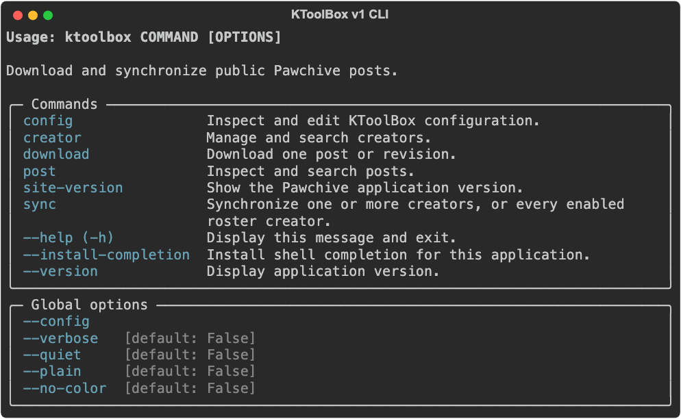

<div align="center">

# KToolBox

An asynchronous CLI and Python client for downloading public posts from [Pawchive](https://pawchive.pw/).

[](https://pypi.org/project/ktoolbox/)
[](https://www.python.org/)
[](LICENSE)
[](https://ktoolbox.readthedocs.io/)

[English](README.md) | [中文](README_zh-CN.md)

</div>

KToolBox v1 uses Pawchive as its only supported backend. It provides typed access to every public operation in the Pawchive OpenAPI document and keeps account-authenticated favorites operations out of scope.

## Features

- Download one post or synchronize any number of creators in one command.
- Keep a reusable, enabled/disabled creator roster in project-local `ktoolbox.toml`.
- Exclude non-work posts with ordered global or creator-scoped field blockers.
- Reuse one typed asynchronous `PawchiveClient` across API operations.
- Resume partial downloads with HTTP Range requests and skip existing files.
- Limit file sizes, select extensions, filter titles and dates, and control cover/attachment downloads.
- Customize directory structure, post names, file names, sequential names, and year/month grouping.
- Save post metadata, creator indices, extracted content, content images, and matching external links.
- Stream jobs from concurrent creator producers into one fair download pool with stable Rich progress, per-file speeds, and aggregate throughput.
- Use a fully offline MockTransport-based test suite; accidental network access is blocked in tests.

## Requirements

- Python 3.10 through 3.14
- Windows, macOS, or Linux

## Installation

Using `pipx` is recommended:

```bash
pipx install ktoolbox
```

Optional event-loop and terminal configuration-editor dependencies:

```bash
# Windows
pipx install "ktoolbox[urwid,winloop]" --force

# Linux / macOS
pipx install "ktoolbox[urwid,uvloop]" --force
```

## Quick Start

Show command help:

```bash
ktoolbox -h
ktoolbox download -h
```



Download one post:

```bash
ktoolbox download https://pawchive.pw/fanbox/user/6570768/post/1836570
```

Synchronize one creator while limiting the first run to one post:

```bash
ktoolbox sync https://pawchive.pw/fanbox/user/6570768 --length 1
```

Use an offset, date range, or title filters:

```bash
ktoolbox sync fanbox:123 patreon:456 --length 10
ktoolbox sync fanbox:123 --start-time 2025-01-01 --end-time 2025-03-01
```

Save frequently synchronized creators, then run `sync` without targets:

```bash
ktoolbox creator add fanbox:123 --alias studio-a
ktoolbox creator add patreon:456 --alias studio-b
ktoolbox sync
```

Downloaded files are skipped on later runs. Incomplete temporary files are resumed when the file host supports ranges.

## Configuration

KToolBox reads `.env`, then `prod.env`, from the current working directory. Nested fields use `__`:

```dotenv
# Pawchive defaults; normally no override is needed.
KTOOLBOX_API__NETLOC=pawchive.pw
KTOOLBOX_API__STATICS_NETLOC=pawchive.pw
KTOOLBOX_API__PATH=/api/v1
KTOOLBOX_DOWNLOADER__FILES_NETLOC=file.pawchive.pw
KTOOLBOX_DOWNLOADER__FILE_PATH_PREFIX=/data

# Download controls.
KTOOLBOX_JOB__COUNT=4
KTOOLBOX_JOB__CREATOR_CONCURRENCY=4
KTOOLBOX_JOB__DOWNLOAD_FILE=True
KTOOLBOX_JOB__DOWNLOAD_ATTACHMENTS=True
KTOOLBOX_JOB__MAX_FILE_SIZE=1048576
```

`KTOOLBOX_DOWNLOADER__SESSION_KEY`, if set, is sent only to file downloads. The API client never sends an account session.

`.env` controls runtime and transfer behavior. A project-level `ktoolbox.toml` stores the creator roster and blockers:

```toml
schema_version = 1

[[creators]]
service = "fanbox"
creator_id = "123"
alias = "studio-a"
enabled = true

[[blockers]]
id = "skip-progress-updates"
type = "field-match"
enabled = true
scope = { mode = "creators", creators = ["fanbox:123"] }
options = { rule = { kind = "group", mode = "any", conditions = [{ kind = "field", field = "title", operator = "contains", values = ["progress update"] }] } }
```

Generate references, validate the project file, or launch the optional terminal editor:

```bash
ktoolbox config example
ktoolbox config validate
ktoolbox config edit
```

See [Configuration](https://ktoolbox.readthedocs.io/latest/configuration/guide/) and [`example.env`](example.env).

## Python API

```python
import asyncio

from ktoolbox.api import PawchiveClient


async def main() -> None:
    async with PawchiveClient() as client:
        profile = await client.get_creator_profile("fanbox", "6570768")
        posts = await client.list_creator_posts(profile.service, profile.id, offset=0)
        print(profile.name, len(posts))


asyncio.run(main())
```

Successful calls return Pydantic v2 models. Transport, HTTP status, authentication, not-found, conflict, and response-validation failures use distinct exception classes. See the [API documentation](https://ktoolbox.readthedocs.io/latest/api/).

## Migrating From v0

v1 removes the Kemono/Coomer compatibility layer and the old `BaseAPI`, module-level `get_*`, `APIRet`, and wrapper-response interfaces. Fire commands were replaced by Cyclopts: use `download`, `sync`, `creator`, `post`, and `config`. Hidden aliases remain temporarily available with a deprecation warning. Move `KTOOLBOX_API__SESSION_KEY` to `KTOOLBOX_DOWNLOADER__SESSION_KEY` and review the [v1 migration guide](https://ktoolbox.readthedocs.io/latest/migration-v1/).

The historical `kemono_openapi.json` remains in the repository for reference only; it is not a supported runtime contract.

## Development

```bash
poetry install --with test,docs,dev
poetry run pytest --cov
poetry run ruff check k_generator ktoolbox/api ktoolbox/blocker ktoolbox/cli.py ktoolbox/cli_app.py ktoolbox/job/stream.py ktoolbox/project_config.py ktoolbox/reporting.py ktoolbox/sync.py tests
poetry run mypy --strict ktoolbox/api/client.py ktoolbox/api/errors.py ktoolbox/api/parameters.py ktoolbox/api/utils.py ktoolbox/blocker ktoolbox/cli.py ktoolbox/cli_app.py ktoolbox/job/stream.py ktoolbox/project_config.py ktoolbox/reporting.py ktoolbox/sync.py
poetry run mkdocs build --strict
```

Default tests are hermetic and must not contact Pawchive or any other remote service.

## License

KToolBox is licensed under the [BSD 3-Clause License](LICENSE).
