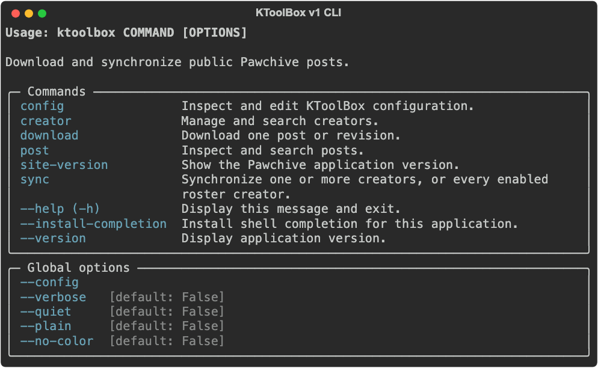
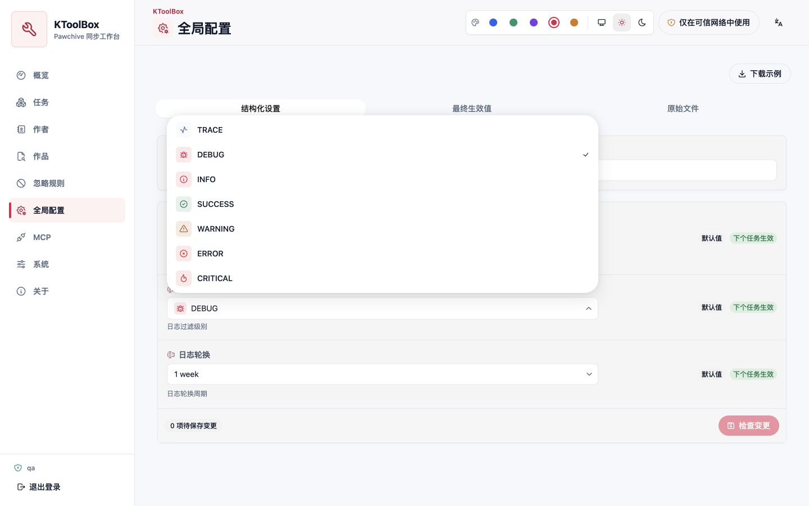

<div align="center">

# KToolBox

Асинхронный инструмент командной строки, панель управления HeroUI и клиент Python для скачивания общедоступных публикаций с [Pawchive](https://pawchive.pw/).

[](https://pypi.org/project/ktoolbox/)
[](https://www.python.org/)
[](LICENSE)
[](https://ktoolbox.readthedocs.io/latest/ru/)

[English](README.md) | [简体中文](README_zh-CN.md) | [繁體中文](README_zh-Hant.md) | [Русский](README_ru.md) | [日本語](README_ja.md) | [한국어](README_ko.md) | [Français](README_fr.md)

</div>

KToolBox v1 использует Pawchive как единственный поддерживаемый сервер. Проект предоставляет типизированный доступ ко всем общедоступным операциям из документа OpenAPI Pawchive и намеренно не поддерживает операции с избранным, требующие аутентификации учётной записи.

## Возможности

- Скачивание одной публикации или синхронизация любого количества авторов одной командой.
- Хранение многократно используемого списка авторов с возможностью включения и отключения в локальном для проекта файле `ktoolbox.toml`.
- Исключение публикаций, не относящихся к работам, с помощью упорядоченных глобальных или привязанных к автору правил фильтрации полей.
- Повторное использование одного типизированного асинхронного `PawchiveClient` для разных операций API.
- Продолжение частично выполненных загрузок с помощью HTTP Range и пропуск существующих файлов.
- Ограничение размера файлов, выбор расширений, фильтрация заголовков и дат, а также раздельное управление скачиванием обложек и вложений.
- Настройка структуры каталогов, названий публикаций и файлов, последовательной нумерации и группировки по году и месяцу.
- Сохранение метаданных публикаций, индексов авторов, извлечённого содержимого, встроенных изображений и подходящих внешних ссылок.
- Потоковая передача заданий от параллельно обрабатываемых авторов в общий справедливый пул загрузок со стабильным индикатором Rich, скоростью каждого файла и общей пропускной способностью.
- Управление одним проектом синхронизации через адаптивную панель HeroUI на семи языках: постоянные задачи, ход выполнения в реальном времени, формы конфигурации, редакторы списка авторов и правил исключения, светлая и тёмная темы.
- Полностью автономный набор тестов на основе MockTransport, блокирующий случайный доступ к сети.

## Требования

- Python 3.10–3.14
- Windows, macOS или Linux

## Установка

Рекомендуется использовать `pipx`:

```bash
pipx install ktoolbox
```

Необязательные зависимости для оптимизированного цикла событий и редактора конфигурации в терминале:

```bash
# Windows
pipx install "ktoolbox[urwid,winloop]" --force

# Linux / macOS
pipx install "ktoolbox[urwid,uvloop]" --force
```

Установка необязательных компонентов WebUI:

```bash
pipx install "ktoolbox[webui]" --force
```

## Быстрый старт

Просмотр справки по командам:

```bash
ktoolbox -h
ktoolbox download -h
```



Скачивание одной публикации:

```bash
ktoolbox download https://pawchive.pw/fanbox/user/6570768/post/1836570
```

Синхронизация одного автора с ограничением первого запуска одной публикацией:

```bash
ktoolbox sync https://pawchive.pw/fanbox/user/6570768 --length 1
```

Использование смещения, диапазона дат или фильтров заголовков:

```bash
ktoolbox sync fanbox:123 patreon:456 --length 10
ktoolbox sync fanbox:123 --start-time 2025-01-01 --end-time 2025-03-01
```

Сохранение часто синхронизируемых авторов и последующий запуск `sync` без целей:

```bash
ktoolbox creator add fanbox:123 --alias studio-a
ktoolbox creator add patreon:456 --alias studio-b
ktoolbox sync
```

При повторных запусках существующие файлы пропускаются. Незавершённые временные файлы продолжают скачиваться, если файловый сервер поддерживает диапазоны байтов.

## WebUI

WebUI привязывается к одному каталогу проекта, содержащему `ktoolbox.toml`. Учётные данные можно не задавать: тогда терминал покажет имя `admin` и новый случайный пароль для текущего процесса. Для постоянных данных рекомендуется хеш Argon2id:

```bash
ktoolbox webui hash-password
```

Добавьте выведенный хеш и имя пользователя в файл `.env` проекта, затем запустите панель:

```dotenv
KTOOLBOX_WEBUI__USERNAME=owner
KTOOLBOX_WEBUI__PASSWORD_HASH='$argon2id$...'
```

```bash
ktoolbox webui /path/to/project
```



Весь интерфейс доступен на упрощённом и традиционном китайском, английском, японском, корейском, французском и русском языках. При первом запуске выбирается язык браузера; ручной выбор сохраняется и одновременно переключает даты, числа, сортировку, описания настроек, проверку ввода и ошибки сервера.

Строки задач сохраняют удобочитаемые заголовки публикаций и имена авторов в автономном снимке представления. В настольном и мобильном интерфейсах доступны сведения, жизненный цикл, редактирование, изменение порядка и удаление; переключатели форм используют серый цвет в выключенном и синий во включённом состоянии, а флажки показывают отметку только при выборе.

Глобальная конфигурация использует Select или ComboBox по смыслу поля и показывает выбор пути только для настоящих расположений. Завершённую синхронизацию можно запустить снова в той же записи; подтверждение удаления показывает понятную цель и раскрываемый список относительных путей вместо внутреннего UUID. Страница «О программе» собирает версию, лицензию, среду выполнения и официальные ссылки, а URL и адреса прослушивания отображаются встроенным кодом.

Формат имён и каталог загрузки по умолчанию задаются для проекта. Страница **Формат имён** отдельно сохраняет структуру и шаблоны; относительный путь считается от проекта, а абсолютный может находиться вне него. Многоразовый преобразователь позволяет выбрать несколько версий истории или вставить старую `.env`/TOML-конфигурацию в редактор с подсветкой. Текущий проект всегда остаётся целью только для чтения, вставленный текст не сохраняется, а перемещения поддерживают паузу, продолжение и откат. При обнаружении старых dotenv-ключей WebUI запрашивает подтверждение перед миграцией с резервной копией и не сканирует каталоги автоматически. См. [руководство по формату имён](https://ktoolbox.readthedocs.io/latest/ru/naming/).

Страница **Автоматическая синхронизация** поддерживает несколько планов Cron или с фиксированным интервалом, показывает следующие три запуска и позволяет ставить план на паузу или запускать его сразу. Контрольные точки продвигаются отдельно по авторам, а обновления не загружают заголовки и медиа. См. [руководство по автоматической синхронизации](https://ktoolbox.readthedocs.io/latest/ru/automatic-sync/).

Необязательный просмотр NSFW по умолчанию выключен и хранится только как настройка текущего браузера. Включение требует подтверждения; аватары, баннеры, обложки и поддерживаемые изображения загружаются исключительно через аутентифицированный прокси того же источника. Он проверяет декодированный растр и отклоняет перенаправления, SVG, не-изображения, повреждённые и превышающие лимит ресурсы. См. [руководство WebUI](https://ktoolbox.readthedocs.io/latest/ru/webui/#необязательный-просмотр-чувствительных-медиа).

Неудачная задача сохраняет очищенный поэтапный отчёт с автором или файлом, возможностью повтора, безопасными путями полей и рекомендацией. Компактный мобильный интерфейс использует панель 64px и отступы 12px, переносит оформление в небольшой Popover и сворачивает каталог MCP по категориям.

После входа одно соединение SSE автоматически синхронизирует задачи, авторов, правила исключения, конфигурацию, токены MCP и открытые удалённые каталоги между вкладками. При разрыве только локальные данные обновляются каждые 10 секунд без опроса поиска Pawchive или сведений о произведениях; несохранённые черновики форм защищены от внешних изменений.

Слушатель по умолчанию `0.0.0.0:8789` удобен в доверенной локальной сети, но HTTP не защищает учётные данные и данные проекта при передаче. В недоверенных сетях привяжите службу к `127.0.0.1` или разместите её за обратным прокси-сервером HTTPS. Незаданные учётные данные создаются только для текущего процесса и выводятся только в его терминале. Жизненный цикл задач, безопасность и развёртывание описаны в [руководстве по WebUI](https://ktoolbox.readthedocs.io/latest/ru/webui/).

## MCP

При запуске WebUI также запускается отобранный сервис MCP Streamable HTTP по адресу `/mcp`. OpenAPI YAML аутентифицированного REST API WebUI доступен по `/api/v1/openapi.yaml`. После входа откройте страницу **MCP** и повторно подтвердите пароль, чтобы создать токен только для чтения или управления. Открытое значение показывается один раз и может быть отозвано на той же странице.

Пример конфигурации Codex:

```toml
[mcp_servers.ktoolbox]
url = "http://127.0.0.1:8789/mcp"
bearer_token_env_var = "KTOOLBOX_MCP_TOKEN"
```

Страница также создаёт конфигурации для обычного HTTP, Claude, Cursor и VS Code. Права, ограничения и рекомендации по HTTPS описаны в [руководстве MCP](https://ktoolbox.readthedocs.io/latest/ru/mcp/).

## Конфигурация

KToolBox последовательно читает `.env`, затем `prod.env` из текущего рабочего каталога. Для вложенных полей используется `__`:

```dotenv
# Значения Pawchive по умолчанию; обычно менять их не требуется.
KTOOLBOX_API__NETLOC=pawchive.pw
KTOOLBOX_API__STATICS_NETLOC=pawchive.pw
KTOOLBOX_API__PATH=/api/v1
KTOOLBOX_DOWNLOADER__FILES_NETLOC=file.pawchive.pw
KTOOLBOX_DOWNLOADER__FILE_PATH_PREFIX=/data

# Управление загрузками.
KTOOLBOX_JOB__COUNT=4
KTOOLBOX_JOB__CREATOR_CONCURRENCY=4
KTOOLBOX_JOB__DOWNLOAD_FILE=True
KTOOLBOX_JOB__DOWNLOAD_ATTACHMENTS=True
KTOOLBOX_JOB__MAX_FILE_SIZE=1048576
```

Если задан `KTOOLBOX_DOWNLOADER__SESSION_KEY`, он отправляется только при скачивании файлов. Клиент API никогда не отправляет сеанс учётной записи.

Файл `.env` управляет выполнением и передачей данных. Проектный `ktoolbox.toml` хранит формат имён, список авторов, планы автоматической синхронизации и правила исключения:

```toml
schema_version = 5

[[creators]]
service = "fanbox"
creator_id = "123"
alias = "studio-a"
enabled = true

[[blockers]]
id = "skip-progress-updates"
type = "field-match"
enabled = true
scope = { mode = "creators", creators = ["fanbox:123"] }
options = { rule = { kind = "group", mode = "any", conditions = [{ kind = "field", field = "title", operator = "contains", values = ["отчёт о ходе работы"] }] } }
```

Создание примера конфигурации, проверка файла проекта или запуск необязательного терминального редактора:

```bash
ktoolbox config example
ktoolbox config validate
ktoolbox config edit
```

Подробнее см. в [руководстве по конфигурации](https://ktoolbox.readthedocs.io/latest/ru/configuration/guide/) и файле [`example.env`](example.env).

## Python API

```python
import asyncio

from ktoolbox.api import PawchiveClient


async def main() -> None:
    async with PawchiveClient() as client:
        profile = await client.get_creator_profile("fanbox", "6570768")
        posts = await client.list_creator_posts(profile.service, profile.id, offset=0)
        print(profile.name, len(posts))


asyncio.run(main())
```

Успешные вызовы возвращают модели Pydantic v2. Ошибки транспорта, состояния HTTP, аутентификации, отсутствия ресурса, конфликта и проверки ответа представлены отдельными классами исключений. См. [документацию API](https://ktoolbox.readthedocs.io/latest/ru/api/).

## Переход с v0

В v1 удалены слой совместимости с Kemono/Coomer и прежние интерфейсы `BaseAPI`, функции `get_*` уровня модуля, `APIRet` и обёртки ответов. Fire заменён на Cyclopts: используйте команды `download`, `sync`, `creator`, `post` и `config`. Скрытые псевдонимы временно сохранены и выводят предупреждение об устаревании. Перенесите `KTOOLBOX_API__SESSION_KEY` в `KTOOLBOX_DOWNLOADER__SESSION_KEY` и ознакомьтесь с [руководством по переходу на v1](https://ktoolbox.readthedocs.io/latest/ru/migration-v1/).

Исторический файл `kemono_openapi.json` оставлен в репозитории только для справки и не является поддерживаемым контрактом среды выполнения.

## Разработка

```bash
poetry install --with test,docs,dev
poetry run pytest --cov
poetry run ruff check k_generator ktoolbox/api ktoolbox/blocker ktoolbox/cli.py ktoolbox/cli_app.py ktoolbox/job/stream.py ktoolbox/project_config.py ktoolbox/reporting.py ktoolbox/sync.py tests
poetry run mypy --strict ktoolbox/api/client.py ktoolbox/api/errors.py ktoolbox/api/parameters.py ktoolbox/api/utils.py ktoolbox/blocker ktoolbox/cli.py ktoolbox/cli_app.py ktoolbox/job/stream.py ktoolbox/project_config.py ktoolbox/reporting.py ktoolbox/sync.py
poetry run mkdocs build --strict
cd webui && npm ci && npm run typecheck && npm run lint && npm run test && npm run build && npm run test:e2e
```

Стандартные тесты полностью автономны и не должны обращаться к Pawchive или другим удалённым службам.

## Лицензия

KToolBox распространяется по лицензии [BSD 3-Clause License](LICENSE).
