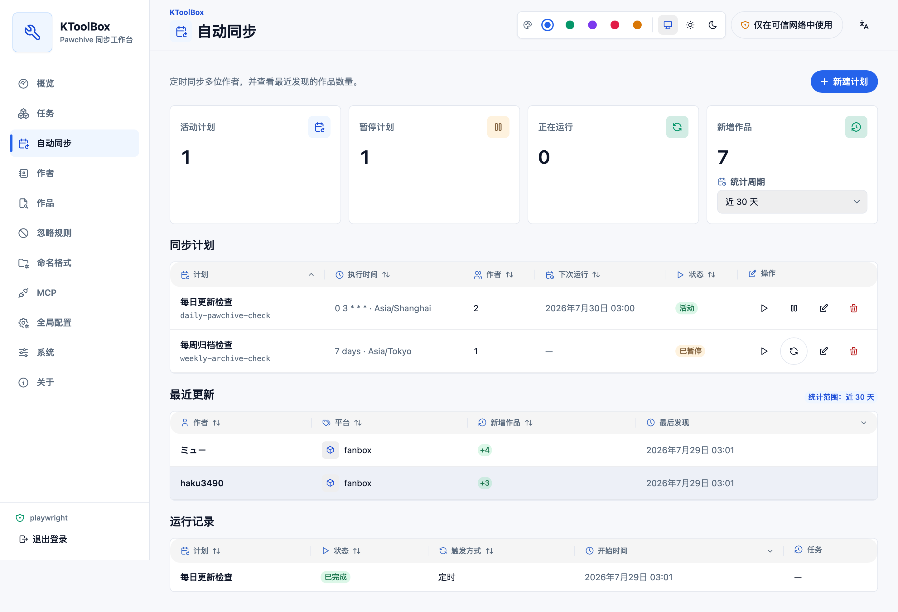
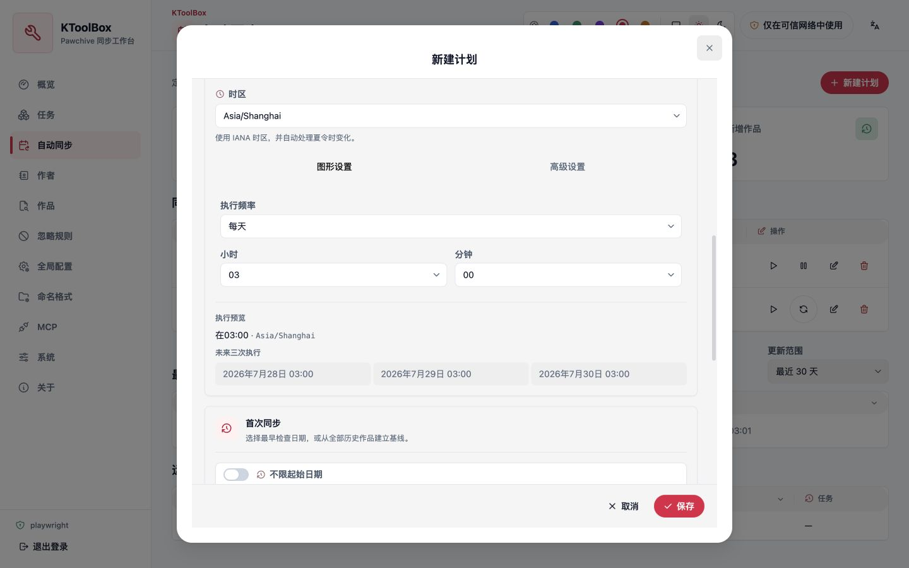

# Automatic synchronization

The **Automatic sync** page runs the existing creator synchronization workflow on a schedule. Every run creates a normal task, so progress, failures, pause, stop, and logs remain available from **Tasks**.

## Create a plan

1. Add the creators to the project roster.
2. Open **Automatic sync** and select **New plan**.
3. Select one or more creators.
4. Choose a five-field Cron schedule or a fixed interval of at least 15 minutes.
5. Select an IANA time zone and review the next three run times.
6. Choose the first discovery date and synchronization options, then save.

Cron plans support common hourly, daily, weekly, and monthly schedules through the visual editor. The advanced editor accepts standard five-field expressions. Interval plans keep a fixed anchor; **Run now** does not move the next automatic run.

## Checkpoints and recent updates

Each run fixes its end time before synchronization starts. KToolBox prefers Pawchive's UTC-like `added` time, checks a 24-hour overlap before the last successful checkpoint, and deduplicates works by platform, creator ID, and work ID. This avoids gaps without counting the same work twice.

- A successful creator advances its own checkpoint.
- A failed creator keeps its previous checkpoint; other successful creators still advance.
- A first run with **No start date** establishes a baseline and does not count all history as new.
- **Run now** uses and advances the same checkpoints as scheduled runs.
- Recent updates show creator names and new-work counts only; titles and media are not loaded.
- The **New works** card controls the period for both its total and the list below: **Today** uses local midnight, while **Last 24 hours**, 7, 14, and 30 days are rolling windows.

## Pause, conflicts, and missed runs

Pausing a plan prevents future automatic triggers but does not stop its current task. A paused plan can still be run manually. If the same plan already has an active task, a scheduled trigger is recorded as skipped and **Run now** links to the existing task.

Runs missed while KToolBox is stopped are not replayed. On startup, the scheduler calculates the first future execution time.
