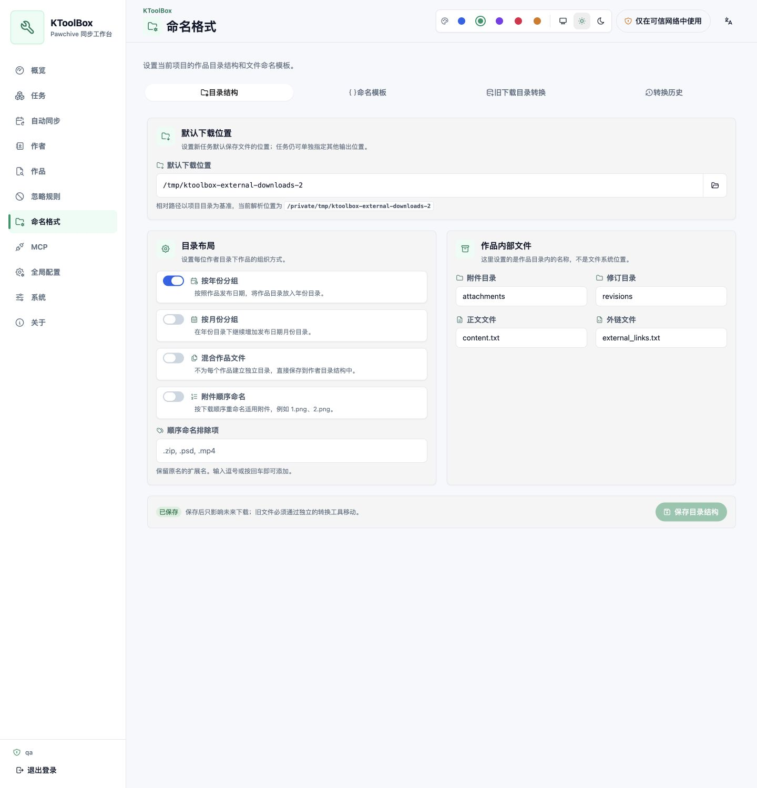
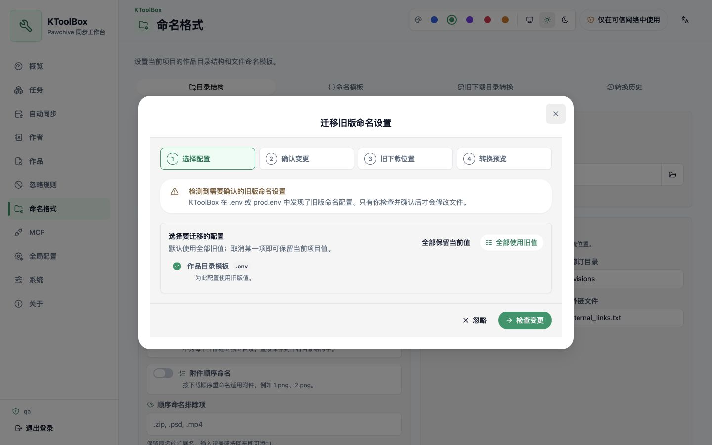

# Format de nommage

Dans KToolBox v1, le nommage appartient au projet. La CLI et la WebUI lisent la même section `[naming]` de `ktoolbox.toml` ; ces champs ne sont plus modifiés comme paramètres dotenv globaux.

## Configurer la structure

La page **Format de nommage** permet de définir :

- les modèles de dossiers d’auteur, d’œuvre, de révision, d’année et de mois ;
- les modèles du fichier principal et des pièces jointes ;
- les noms internes des pièces jointes, révisions, contenus et liens externes ;
- le classement annuel ou mensuel, le mélange des œuvres et la numérotation des pièces jointes.

Seules les variables affichées à côté du champ sont acceptées, par exemple `{creator_name}`, `{creator_id}`, `{service}`, `{title}`, `{post_id}`, `{revision_id}`, `{year}` et `{month}`. Les séparateurs de chemin, remontées parent, variables inconnues et noms dangereux sont refusés avant l’analyse.

**Structure des répertoires** et **Modèles de nommage** disposent de boutons d’enregistrement distincts. L’enregistrement s’applique immédiatement aux futurs téléchargements, sans jamais déplacer les anciens fichiers.

L’**emplacement de téléchargement par défaut** appartient aussi au projet. Sa valeur initiale est `downloads` ; un chemin relatif est résolu depuis la racine du projet et un chemin absolu peut sortir du projet. L’ordre est : sortie explicite de la tâche, sortie explicite du plan de synchronisation automatique, puis valeur par défaut du projet. Chaque tâche conserve le chemin absolu résolu à sa création.

## Convertir les anciens emplacements

Ouvrez l’onglet séparé **Conversion des anciens téléchargements** uniquement si le contenu existant doit adopter le format enregistré. Ajoutez les anciens emplacements, puis lancez leur analyse. Ces emplacements sont des sources de conversion, pas les destinations des futures tâches.

L’analyse lit directement le système de fichiers, ne dépend pas uniquement de l’historique des tâches et ne contacte pas Pawchive. Elle utilise l’identité des dossiers d’auteur, `creator-indices.ktoolbox` et `post.json`, sans suivre les liens symboliques hors des emplacements choisis.

La prévisualisation indique anciens et nouveaux chemins, nombres d’œuvres et de fichiers, taille totale, éléments ignorés et conflits. Tous les auteurs convertibles en sécurité sont sélectionnés par défaut.

KToolBox n’écrase ni ne fusionne une cible. Une prévisualisation périmée, une configuration modifiée, une tâche liée active, une cible dupliquée ou un changement du système de fichiers impose une nouvelle analyse.

## Convertir et récupérer

KToolBox exécute les déplacements choisis dans une tâche persistante en arrière-plan. **Pause** attend la fin de l’opération de fichier atomique en cours et conserve les déplacements achevés. **Continuer** revérifie la configuration, l’empreinte du système de fichiers, les conflits et l’espace libre. **Annuler** restaure les déplacements en ordre inverse. Une erreur d’écriture ou une interruption déclenche également une restauration sûre.

La progression et l’historique résident dans `.ktoolbox/webui.sqlite3`. Les journaux temporaires sont supprimés après réussite ; l’historique reste jusqu’à sa suppression manuelle. Les anciens dossiers devenus vides sont retirés, jamais les fichiers sans rapport.

## Migration au premier démarrage

L’assistant n’apparaît que si KToolBox détecte d’anciennes clés de nommage dans `.env` ou `prod.env`. Le démarrage se limite à la détection et à un avertissement dans le terminal ; aucun fichier n’est modifié. Après connexion, l’assistant :

1. présente la source, l’ancienne valeur et la valeur actuelle ;
2. sélectionne les anciennes valeurs par défaut, avec choix champ par champ ;
3. prévisualise les modifications du projet et les clés dotenv supprimées ;
4. après confirmation, sauvegarde sous `.ktoolbox/migrations/project-naming-v2/`, écrit `ktoolbox.toml` et supprime les anciennes clés de façon atomique ;
5. propose ensuite, séparément, la conversion des anciens répertoires.

Fermer ou choisir **Ignorer** ne masque que cette occurrence. Tant que les anciennes clés existent, l’assistant réapparaît après actualisation ou reconnexion. Migration de configuration et conversion de répertoires sont distinctes : vérifiez les anciens emplacements puis lancez explicitement leur analyse. Ouvrir l’outil ne déclenche ni analyse ni déplacement.

La CLI utilise également le nommage du projet. Pour un ancien projet, confirmez dans la WebUI la migration atomique avec sauvegarde. Les anciennes valeurs présentes uniquement dans l’environnement du processus ne peuvent pas être supprimées : elles sont ignorées pour le nommage et restent signalées jusqu’à leur retrait de l’environnement de lancement.
