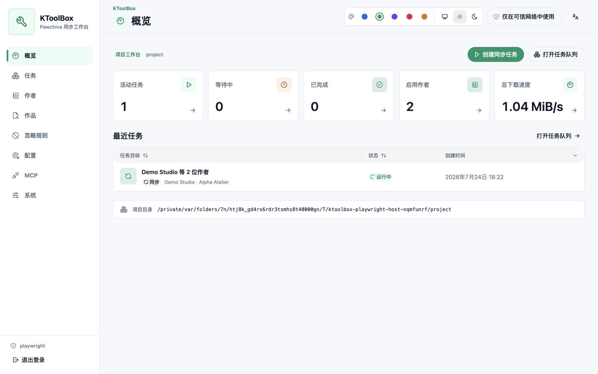
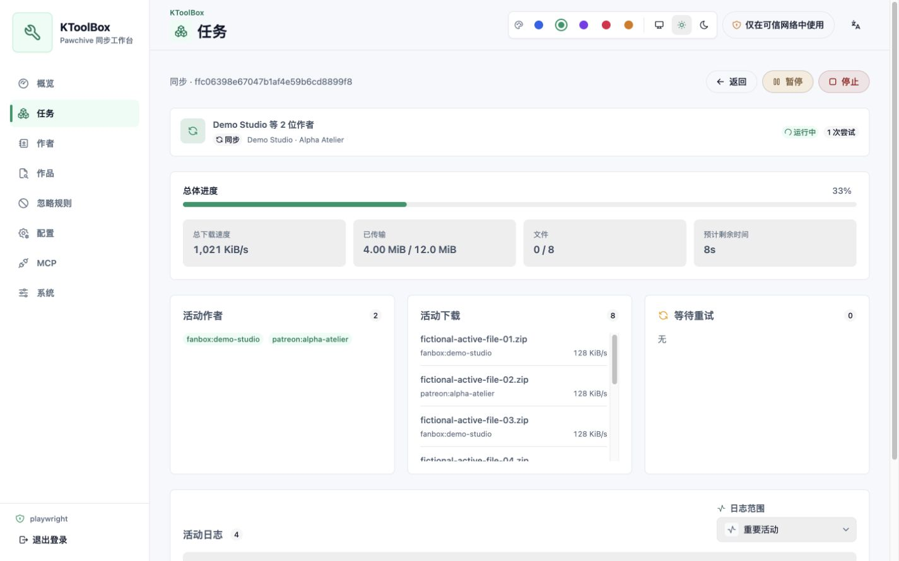

# WebUI

La WebUI de KToolBox est un panneau de gestion lié à un projet, construit avec React et HeroUI. Elle modifie la même configuration et appelle les mêmes services Python que la CLI ; elle ne lance ni n'analyse de sous-processus CLI. Les tâches, tentatives, journaux et enregistrements de propriété sont conservés dans `.ktoolbox/webui.sqlite3` au sein du projet choisi.

## Installation et démarrage

Installez les composants facultatifs et créez un répertoire de projet :

```bash
pipx install "ktoolbox[webui]" --force
mkdir ktoolbox-project
cd ktoolbox-project
```

Les identifiants sont facultatifs au démarrage. S'ils sont absents, le terminal affiche le nom `admin` et un nouveau mot de passe aléatoire valable pour ce processus. Pour utiliser des identifiants stables, générez un hachage Argon2id au moyen d'une saisie masquée :

```bash
ktoolbox webui hash-password
```

Enregistrez le compte dans le fichier `.env` du projet. Placez le hachage entre guillemets afin que les caractères `$` de style shell restent littéraux :

```dotenv
KTOOLBOX_WEBUI__USERNAME=owner
KTOOLBOX_WEBUI__PASSWORD_HASH='$argon2id$v=19$...'
```

Démarrez le panneau pour ce projet :

```bash
ktoolbox webui .
ktoolbox webui . --host 127.0.0.1 --port 8789 --no-open
```

La valeur par défaut est `0.0.0.0:8789` et le navigateur local s'ouvre automatiquement. `--host`, `--port` et `--no-open` remplacent la configuration d'environnement pour ce processus. Si `ktoolbox.toml` manque, le démarrage affiche un avertissement et crée atomiquement un document minimal valide. L'absence d'identifiants ne bloque plus le démarrage : un nom vide devient `admin` et, si les deux formes de mot de passe sont vides, un nouveau mot de passe est généré et affiché dans le terminal pour cette exécution.

## Modèle de sécurité

KToolBox possède un seul compte WebUI local. La configuration explicite est prioritaire et `KTOOLBOX_WEBUI__PASSWORD_HASH` prime sur le réglage compatible en clair `KTOOLBOX_WEBUI__PASSWORD`. Si aucun mot de passe n'est configuré, KToolBox en génère un en mémoire à chaque démarrage et l'affiche avec le nom effectif uniquement dans ce terminal. Pour un déploiement stable, configurez de préférence un hachage et excluez les deux fichiers dotenv du contrôle de version.

Les sessions utilisent des jetons opaques aléatoires. SQLite ne stocke que leur hachage ; le cookie du navigateur est `HttpOnly` et `SameSite=Strict`, et devient `Secure` avec HTTPS. Les requêtes modificatrices exigent un jeton CSRF par session et la vérification de la même origine. Les tentatives de connexion sont limitées, les réponses d'API ne sont pas mises en cache et l'application envoie des en-têtes restrictifs pour le contenu, les cadres, la provenance et les autorisations du navigateur.

Le serveur intégré utilise HTTP. Son écoute par défaut sur le réseau local ne convient qu'à un réseau fiable, car mots de passe, cookies, chemins, journaux et configuration sont autrement visibles en transit. Pour une machine, utilisez `--host 127.0.0.1`. Pour un accès distant, terminez HTTPS sur un proxy inverse fiable et restreignez l'accès réseau. La page de connexion et l'enveloppe de l'application conservent un avertissement HTTP tant que la page n'est pas sécurisée.

Un seul planificateur peut ouvrir un projet à la fois. Un verrou empêche deux processus WebUI de se concurrencer sur la file et les sorties.

Le sélecteur de chemin distant utilise les droits du processus KToolBox. Les champs de tâche, de publication et de structure de téléchargement limités au projet ne peuvent pas sortir du projet lié, y compris via un lien symbolique. Les champs du répertoire de stockage et des journaux couvrent explicitement l'hôte et peuvent révéler les noms et métadonnées accessibles à ce compte. Les API du sélecteur se limitent à lister les métadonnées et à créer des répertoires : elles ne lisent pas le contenu, ne transfèrent, ne renomment et ne suppriment aucun fichier. Saisir un nouveau nom sélectionne un chemin sans créer de fichier vide. Considérez l'accès WebUI comme un accès sensible à l'hôte et ne l'accordez pas à des utilisateurs non fiables.

## Processus du projet

L'interface suit la langue du navigateur lors de la première utilisation et conserve le choix du chinois simplifié, du chinois traditionnel, de l'anglais, du japonais, du coréen, du français ou du russe. Changer de langue actualise aussi les dates React Aria, les formats numériques, le tri naturel, les métadonnées de configuration, la validation et les erreurs serveur connues. Le thème suit le système d'exploitation jusqu'au choix du mode clair ou sombre. Des accents bleu, émeraude, violet, rose et ambre sont proposés ; les interrupteurs activés restent bleus afin que leur état soit cohérent. L'ordinateur utilise une barre latérale compacte et les écrans étroits un Drawer.


Les zones modifiables utilisent une surface secondaire discrète avec des arrière-plans de champs distincts. Les icônes facilitent le repérage, tandis que les interrupteurs et cases restent alignés à gauche avec leur libellé au lieu de ressembler à des boutons centrés. La piste est grise à l'arrêt et bleue en marche ; les cases n'affichent un indicateur que lorsqu'elles sont cochées ou indéterminées. Le contenu de la fenêtre modifiable et sa barre d'actions fixe partagent une surface continue.

Les zones principales sont :

- **Vue d'ensemble :** chemin du projet, état de la file, totaux des transferts actifs et tâches récentes.
- **Tâches :** créer, modifier, mettre en pause, reprendre, arrêter, relancer, supprimer et examiner des synchronisations ou téléchargements uniques. Un clic sur une ligne ouvre les détails et la sélection multiple permet les actions groupées compatibles.
- **Créateurs :** rechercher dans Pawchive et ajouter, modifier la note, activer, désactiver ou retirer des entrées, y compris par actions groupées.
- **Publications :** rechercher sans afficher les médias distants ni le corps développé, examiner les révisions et créer une tâche de téléchargement.
- **Règles d'exclusion :** ordonner et limiter `field-match`, composer des groupes `any`/`all` imbriqués et des conditions de contenu, égalité, expression régulière et existence.
- **Configuration :** modifier `.env`, `prod.env` et `ktoolbox.toml` dans des formulaires typés ou des vues de texte avancées.
- **Système :** examiner les versions du projet et de l'application et télécharger un exemple d'environnement.


La création d'une tâche utilise deux onglets fixes sans commandes de débordement. Les dates de synchronisation restent dans un unique champ de plage HeroUI officiel au format `year/month/day - year/month/day`, tandis que « Aucune date de début » et « Aucune date de fin » effacent indépendamment la limite correspondante. Le décalage des publications progresse par pas de 50. Les filtres de titre utilisent des HeroUI Chip supprimables, créés avec une virgule ou Entrée. Le téléchargement d'une œuvre unique et l'ajout d'un créateur utilisent des champs HeroUI indépendants, séparés par des fragments de chemin Pawchive au style de code, tels que `/platform/user/creator/post/post` ; les séparateurs ne sont jamais simulés comme des champs de saisie.

L'identifiant du créateur est placé en premier dans les lignes de bureau comme dans les entrées mobiles. La note facultative de la liste est affichée séparément et ne remplace jamais cet identifiant. Lors de la modification d'un créateur existant, sa plateforme et son identifiant restent visibles, mais en lecture seule, car ils identifient ensemble l'entrée enregistrée.

## Modification de la configuration

Les libellés et descriptions sont du texte explicitement localisé, pas des identifiants Python. Les docstrings `:ivar field:` de la classe anglaise restent la source sémantique des champs ; les catalogues dont la complétude est vérifiée fournissent tous les libellés et explications dans les sept langues. Pydantic fournit les types, valeurs par défaut, plages et métadonnées secrètes.

Les onglets `.env` et `prod.env` affichent la valeur effective finale et une puce de provenance. Les valeurs remplacées par l'environnement du processus sont en lecture seule. Les secrets sont masqués par défaut. L'édition avancée du texte affiche un avertissement supplémentaire, car elle peut dévoiler des secrets.

Les champs liés au système de fichiers conservent la saisie manuelle et ajoutent un bouton de navigation. La boîte de dialogue affiche l'ordinateur distant qui exécute KToolBox, et non l'appareil du navigateur, avec emplacements rapides, fil d'Ariane, recherche, éléments cachés, pagination et création de répertoire. Les valeurs de configuration relatives au projet restent relatives après sélection ; les sorties absolues des tâches et publications restent absolues. Les valeurs en lecture seule provenant de l'environnement ne peuvent pas ouvrir le sélecteur.

Avant l'enregistrement, le serveur analyse et valide le fichier proposé, puis renvoie une différence sémantique. Un ETag refuse les modifications obsolètes et le fichier est remplacé atomiquement. L'éditeur TOML utilise le stockage TomlKit/Pydantic existant, les commentaires survivent donc aux changements structurés.


## Cycle de vie des tâches

Les tâches `sync` et `download` conservent toutes les entrées de la CLI correspondante. Une synchronisation sans cible résout la liste actuellement activée lors de la création. Chaque tentative reçoit ensuite un instantané immuable et expurgé de la configuration ; les modifications ultérieures n'affectent que les tentatives futures.

Chaque tâche conserve aussi un instantané réservé à la présentation avec sa clé cible normalisée, ainsi que les titre et nom du créateur facultatifs. Il reste lisible hors ligne et n'affecte jamais l'exécution, la déduplication ou les verrous. Les lignes commencent par cette cible plutôt que le chemin de sortie, et les détails, la pause/reprise, l'arrêt, la modification, le classement et la suppression restent visibles directement.


La file principale exécute deux tâches par défaut (`KTOOLBOX_WEBUI__MAX_ACTIVE_TASKS`), tandis que chacune conserve sa simultanéité configurée de créateurs et de fichiers. Les tâches actives identiques renvoient à la tâche existante. Les tâches dont les sorties, créateurs ou publications normalisés se chevauchent attendent dans `blocked` la libération du verrou.

Les événements en direct utilisent SSE avec reconnexion. L'état REST reste la référence et seul un événement `task.status` peut le modifier ; la fin d'un fichier ne termine jamais prématurément sa tâche. La vitesse globale utilise une fenêtre glissante de cinq secondes et un bref délai de transition, ce qui évite un passage furtif à zéro entre deux fichiers. L'aperçu et la page des tâches additionnent la vitesse des tâches réellement actives.



La vue détaillée indique les créateurs préparés, les fichiers, les octets, la progression totale, les vitesses globale et par fichier, l'heure estimée, les nombres ignorés/échoués, les créateurs actifs, les téléchargements actifs, les nouvelles tentatives en attente et les journaux structurés. Les trois panneaux en direct ont une hauteur stable et leur propre défilement : les changements de simultanéité ne déplacent plus le journal ni la page. La vue d'activité par défaut masque la progression par blocs et le bruit ordinaire de la file ; les vues transferts et diagnostic complet restent disponibles.



Chaque tentative en échec conserve un rapport de diagnostic borné et expurgé au lieu d'un simple compteur. La ligne de tâche affiche la première cause utile ; le détail regroupe les échecs par créateur et fichier et indique l'étape, la possibilité de réessayer, les chemins de champs sûrs et l'action recommandée. Le corps des réponses amont, les titres d'œuvres, les cookies et les URL complètes de téléchargement ne sont jamais enregistrés. Sur écran étroit, la barre de 64px, l'espacement de page de 12px et le Popover d'apparence compact affichent davantage de contenu sans réduire le texte des formulaires sous 16px. Le catalogue MCP utilise des groupes HeroUI repliables et développe automatiquement les groupes correspondant à une recherche ou à un filtre de permission.


La pause est coopérative : les flux réseau actifs se ferment, les fichiers terminés et temporaires pouvant reprendre restent, et la reprise crée une nouvelle tentative. L'arrêt conserve la définition pour pouvoir la modifier et la relancer. Seules les tâches en pause, arrêtées, échouées ou interrompues peuvent reprendre ; une tâche terminée reste modifiable et supprimable, mais ne peut pas reprendre. Un redémarrage marque l'ancien travail actif `interrupted`, efface sa progression active résiduelle et exige une récupération explicite.

Supprimer une tâche ne retire normalement que son enregistrement, ses tentatives et ses journaux. « Supprimer les sorties » présente d'abord le nombre de fichiers et d'octets. La confirmation ne retire que les fichiers ordinaires inchangés enregistrés comme créés par cette tâche ; les liens symboliques et les fichiers préexistants, modifiés ou partagés ne sont ni suivis ni retirés.

## Actualisation automatique

Après la connexion, une seule connexion SSE synchronise les tâches, créateurs, règles d'exclusion, configurations, jetons MCP et répertoires distants ouverts entre les onglets du navigateur. Les changements structurels apparaissent normalement en moins d'une seconde ; la progression des tâches met directement à jour le cache local sans retélécharger toute la liste.

Si la connexion en direct reste indisponible plus de cinq secondes, la WebUI affiche un avertissement compact et actualise les données locales du projet toutes les 10 secondes. Dès le rétablissement de SSE, elle arrête ce mode de secours et effectue une actualisation unique. Les recherches Pawchive, détails d'œuvres et vérifications de version restent à la demande et ne sont jamais lancés par le mode de secours.

La page Système indique la méthode d'actualisation et l'heure du dernier signal, avec des actions d'actualisation et de reconnexion. Si un autre onglet ou client MCP modifie les données pendant qu'un formulaire contient des changements non enregistrés, KToolBox conserve le brouillon et propose de recharger ou de poursuivre l'édition ; les contrôles ETag et d'état restent actifs lors de l'enregistrement.

## Référence de l'environnement WebUI

| Variable | Valeur par défaut | Signification |
| --- | --- | --- |
| `KTOOLBOX_WEBUI__HOST` | `0.0.0.0` | Interface d'écoute. |
| `KTOOLBOX_WEBUI__PORT` | `8789` | Port d'écoute, de 1 à 65535. |
| `KTOOLBOX_WEBUI__OPEN_BROWSER` | `True` | Ouvrir l'URL locale après le démarrage. |
| `KTOOLBOX_WEBUI__USERNAME` | vide → `admin` au démarrage | Nom facultatif du compte unique. |
| `KTOOLBOX_WEBUI__PASSWORD_HASH` | vide | Hachage Argon2id stable recommandé. |
| `KTOOLBOX_WEBUI__PASSWORD` | vide → aléatoire à chaque démarrage | Solution en clair ; ignorée si un hachage existe. |
| `KTOOLBOX_WEBUI__MAX_ACTIVE_TASKS` | `2` | Tâches principales simultanées, de 1 à 16. |
| `KTOOLBOX_WEBUI__SESSION_IDLE_HOURS` | `24` | Durée de session depuis la dernière utilisation. |
| `KTOOLBOX_WEBUI__SESSION_ABSOLUTE_HOURS` | `168` | Durée maximale depuis la connexion. |

Sauvegardez ensemble `ktoolbox.toml`, les fichiers dotenv locaux et `.ktoolbox/webui.sqlite3` lorsque l'historique importe. Ne copiez pas la base pendant l'exécution de la WebUI.

## Vérification multilingue dans le navigateur

Les sept catalogues sont testés réellement sur ordinateur et mobile, en thèmes clair et sombre. Voici deux états représentatifs validés ; le contenu utilisateur et les chemins du système de fichiers conservent leur texte d'origine.


