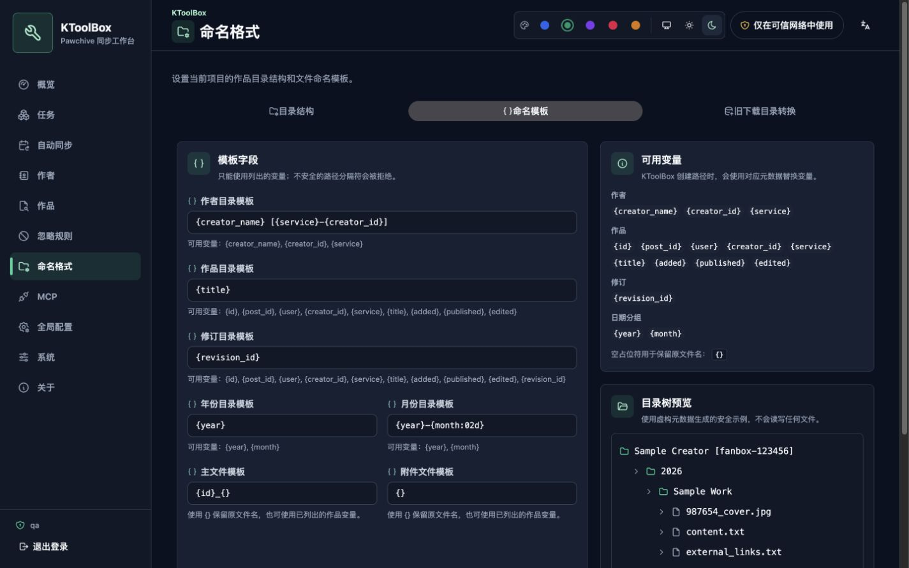
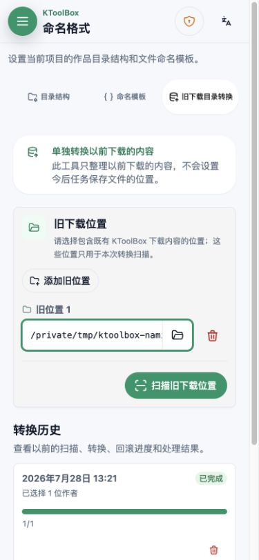
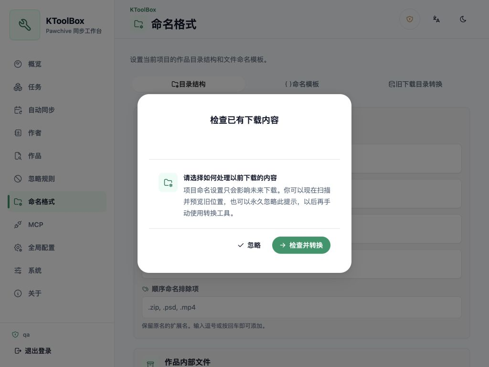

# 이름 형식

KToolBox v1의 이름 설정은 프로젝트별로 관리됩니다. CLI와 WebUI는 `ktoolbox.toml`의 같은 `[naming]` 섹션을 사용하며, 이름 필드는 더 이상 전역 dotenv 설정에서 편집하지 않습니다.

## 디렉터리 구조 설정

WebUI의 **이름 형식** 페이지에서 다음을 설정할 수 있습니다.

- 크리에이터, 작품, 리비전, 연도 및 월 디렉터리 템플릿
- 기본 파일과 첨부 파일 템플릿
- 작품 내부의 첨부, 리비전, 본문 및 외부 링크 이름
- 연/월 그룹, 작품 파일 혼합 및 첨부 순차 이름

템플릿에는 필드 옆에 표시되는 `{creator_name}`, `{creator_id}`, `{service}`, `{title}`, `{post_id}`, `{revision_id}`, `{year}`, `{month}` 같은 변수만 사용할 수 있습니다. 경로 구분자, 상위 경로 이동, 알 수 없는 변수 및 안전하지 않은 이름은 스캔 전에 거부됩니다.

**디렉터리 구조**와 **이름 템플릿**에는 각각 저장 버튼이 있습니다. 저장한 설정은 이후 다운로드에 즉시 적용되지만 기존 파일을 자동으로 이동하지 않습니다.

## 이전 다운로드 위치 변환

기존 콘텐츠를 저장된 형식으로 바꿀 때만 별도의 **이전 다운로드 변환** 탭을 사용합니다. 이전 위치를 추가하고 스캔하세요. 이 위치는 변환 원본이며 이후 작업의 다운로드 대상이 아닙니다.

스캔은 파일 시스템을 직접 읽고 작업 기록에만 의존하지 않으며 Pawchive에도 연결하지 않습니다. 크리에이터 디렉터리 신원, `creator-indices.ktoolbox`, `post.json`을 사용하고 선택 위치 밖으로 나가는 심볼릭 링크를 따르지 않습니다.

미리보기에는 크리에이터별 이전/새 경로, 작품 수, 파일 수, 전체 크기, 건너뜀 및 충돌이 표시됩니다. 안전하게 변환 가능한 크리에이터가 모두 기본 선택됩니다.

KToolBox는 대상을 덮어쓰거나 합치지 않습니다. 오래된 미리보기, 설정 변경, 관련 활성 작업, 중복 대상 또는 파일 시스템 변경이 있으면 다시 스캔해야 합니다.

## 변환 및 복구

KToolBox는 선택한 이동을 영구 백그라운드 작업으로 실행합니다. 취소, 쓰기 실패 또는 프로세스 중단 시 완료된 이동을 역순으로 되돌립니다. 저장된 이름 형식은 이후 다운로드에 계속 적용됩니다.

진행률과 기록은 `.ktoolbox/webui.sqlite3`에 저장됩니다. 성공하면 임시 작업 로그를 지우고 기록은 수동 삭제할 때까지 보존합니다. 비어 있는 이전 디렉터리는 제거하지만 관련 없는 파일은 삭제하지 않습니다.

## 최초 시작 마이그레이션

WebUI 최초 시작 시 기본 프로젝트 설정을 만들기 전에 `.env`와 `prod.env`의 이전 이름 키를 마이그레이션합니다.

1. 유효 값을 `ktoolbox.toml`에 기록
2. `.ktoolbox/migrations/project-naming-v2/`에 백업
3. 이전 dotenv 키 제거
4. 터미널 요약 출력
5. 로그인 후 기존 콘텐츠를 영구히 무시할지 변환을 검토할지 반드시 선택

이 대화상자는 선택 없이 닫을 수 없고 새로 고침 후에도 다시 표시됩니다. **변환 검토**는 전용 탭을 열며, 알려진 이전 위치가 있으면 자동으로 스캔하고 없으면 추가하도록 안내합니다. 미리보기를 확인하기 전에는 파일을 이동하지 않습니다.

CLI도 프로젝트 이름 설정을 사용합니다. 이전 프로젝트는 WebUI를 한 번 시작해 백업과 원자적 설정 마이그레이션을 완료하세요.
