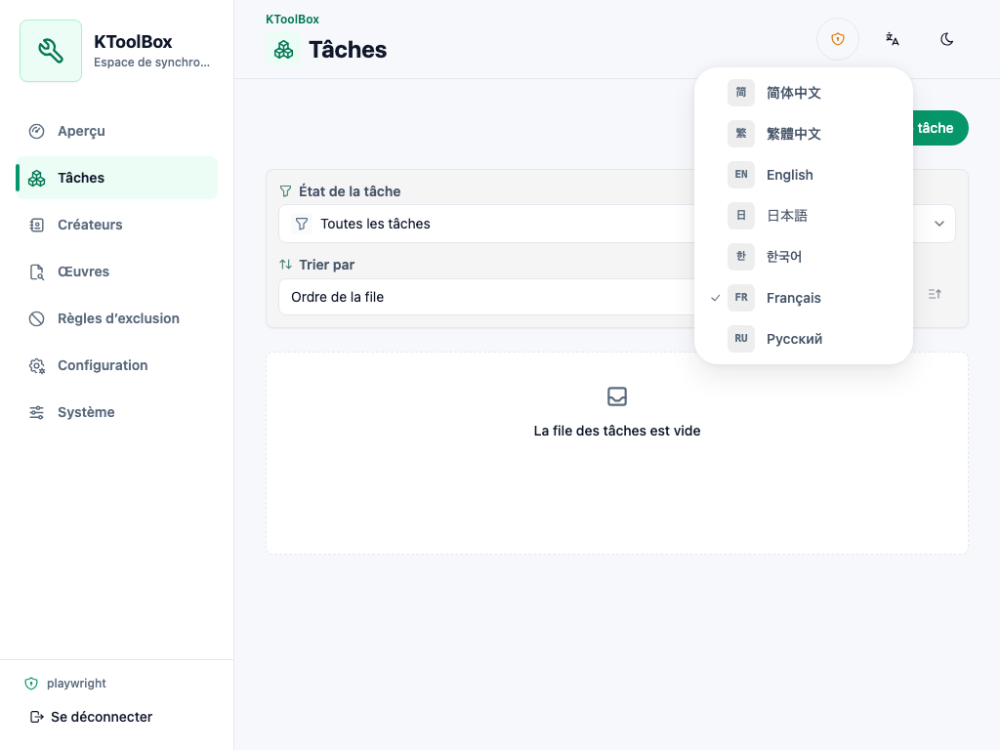
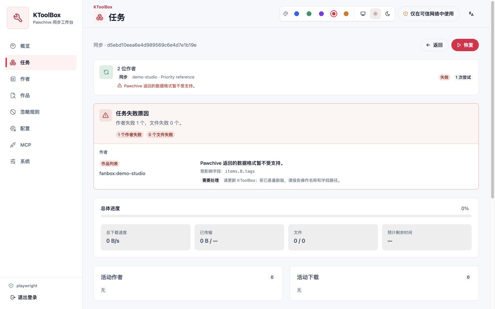
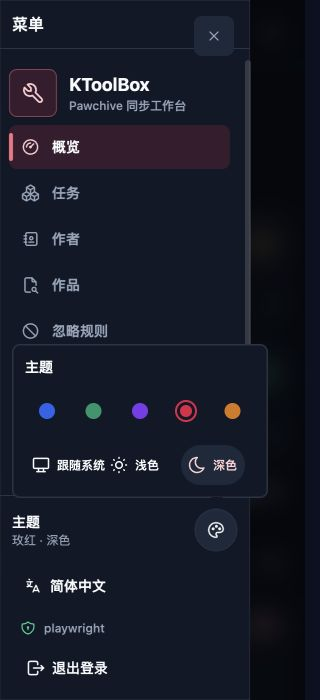
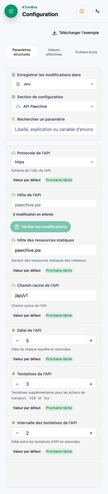

# WebUI

KToolBox WebUI — привязанная к проекту панель управления на React и HeroUI. Она изменяет ту же конфигурацию и вызывает те же службы Python, что и CLI; она не запускает и не разбирает подпроцессы CLI. Задачи, попытки, журналы и записи владения сохраняются в `.ktoolbox/webui.sqlite3` выбранного проекта.

## Установка и запуск

Установите необязательные компоненты и создайте каталог проекта:

```bash
pipx install "ktoolbox[webui]" --force
mkdir ktoolbox-project
cd ktoolbox-project
```

Учётные данные при запуске необязательны. Если они отсутствуют, терминал выводит имя `admin` и новый случайный пароль для этого процесса. Для постоянных данных создайте хеш Argon2id через скрытый ввод:

```bash
ktoolbox webui hash-password
```

Сохраните учётную запись в `.env` проекта. Заключите хеш в кавычки, чтобы символы `$` остались буквальными:

```dotenv
KTOOLBOX_WEBUI__USERNAME=owner
KTOOLBOX_WEBUI__PASSWORD_HASH='$argon2id$v=19$...'
```

Запустите панель для проекта:

```bash
ktoolbox webui .
ktoolbox webui . --host 127.0.0.1 --port 8789 --no-open
```

По умолчанию используется `0.0.0.0:8789`, локальный браузер открывается автоматически. `--host`, `--port` и `--no-open` переопределяют окружение для процесса. Если нет `ktoolbox.toml`, запуск выводит предупреждение и атомарно создаёт минимальный документ. Отсутствие данных больше не блокирует запуск: пустое имя становится `admin`, а при пустых формах пароля новый пароль создаётся и выводится для этого запуска.

## Модель безопасности

KToolBox имеет одну локальную учётную запись WebUI. Явная конфигурация имеет приоритет, а `KTOOLBOX_WEBUI__PASSWORD_HASH` важнее открытого `KTOOLBOX_WEBUI__PASSWORD`. Если пароль не настроен, KToolBox при каждом запуске создаёт его в памяти и выводит вместе с итоговым именем только в этом терминале. Для стабильного развёртывания настройте хеш и исключайте оба dotenv-файла из контроля версий.

Сеансы используют случайные непрозрачные токены. SQLite хранит только их хеши; cookie браузера содержит `HttpOnly` и `SameSite=Strict`, а при HTTPS становится `Secure`. Изменяющие запросы требуют токен CSRF для сеанса и проверку единого источника. Попытки входа ограничиваются, ответы API не кэшируются, приложение отправляет строгие заголовки содержимого, фреймов, источника и разрешений браузера.

Встроенный сервер работает по HTTP. Стандартный слушатель LAN подходит только для доверенной сети, иначе пароли, cookie, пути, журналы и настройки видны при передаче. Для одной машины используйте `--host 127.0.0.1`. Для удалённого доступа завершайте HTTPS на доверенном обратном прокси и ограничивайте сеть. Страница входа и оболочка приложения сохраняют предупреждение HTTP, пока страница небезопасна.

Одновременно проект может открыть только один планировщик. Блокировка не позволяет двум процессам WebUI конкурировать за очередь и вывод.

Удалённый выбор пути использует права процесса KToolBox. Поля задач, публикаций и структуры загрузки с областью проекта не могут выйти за пределы привязанного проекта, в том числе через символические ссылки. Поля каталога хранилища и журнала явно имеют область всего компьютера и могут показывать имена и метаданные везде, куда у этой учётной записи есть доступ. API выбора пути только перечисляет метаданные и создаёт каталоги: он не читает содержимое, не загружает, не скачивает, не переименовывает и не удаляет файлы. Ввод нового имени выбирает путь, но не создаёт пустой файл. Считайте доступ к WebUI чувствительным доступом к компьютеру и не предоставляйте его недоверенным пользователям.

## Процессы проекта

При первом запуске интерфейс следует языку браузера и сохраняет выбор упрощённого или традиционного китайского, английского, японского, корейского, французского либо русского. При смене языка одновременно обновляются даты React Aria, формат чисел, естественная сортировка, метаданные настроек, проверка ввода и известные ошибки сервера. Тема следует системе до выбора светлого или тёмного режима. Доступны синий, изумрудный, фиолетовый, розовый и янтарный акценты; включённые переключатели остаются синими во всех палитрах. На компьютере используется компактная боковая панель, на узких экранах — Drawer.




Редактируемые области используют приглушённую вторичную поверхность с отдельными фонами полей. Значки помогают просмотру, переключатели и флажки выровнены слева с подписями, а не выглядят как центральные кнопки. Дорожка выключенного переключателя серая, включённого — синяя; флажок показывает отметку только при выборе или неопределённом состоянии. Содержимое изменяемого окна и фиксированная панель действий образуют единую поверхность.

Основные разделы:

- **Обзор:** путь проекта, состояние очереди, итоги активных передач и последние задачи.
- **Задачи:** создание, порядок, изменение, пауза, продолжение, остановка, повтор, удаление и просмотр синхронизаций или отдельных загрузок.
- **Авторы:** поиск Pawchive и добавление, изменение примечания, включение, отключение или удаление записей.
- **Публикации:** поиск без удалённых медиа и полного текста, просмотр редакций и создание задачи загрузки.
- **Правила:** порядок и область `field-match`, вложенные `any`/`all`, условия содержания, равенства, регулярного выражения и существования.
- **Конфигурация:** изменение `.env`, `prod.env` и `ktoolbox.toml` через типизированные формы или расширенный текстовый вид.
- **Система:** версии проекта и приложения, скачивание примера окружения.


Форма создания задачи использует две фиксированные вкладки без кнопок переполнения. Даты синхронизации остаются единым официальным полем диапазона HeroUI в формате `year/month/day - year/month/day`; параметры «Без начальной даты» и «Без конечной даты» независимо очищают соответствующую границу. Смещение публикаций изменяется с шагом 50. Фильтры заголовков используют удаляемые HeroUI Chip, создаваемые запятой или Enter. Загрузка отдельной работы и добавление автора используют отдельные поля HeroUI, разделённые фрагментами пути Pawchive в стиле кода, например `/platform/user/creator/post/post`; разделители не имитируют поля ввода.

Идентификатор автора стоит первым как в строках на компьютере, так и в мобильных карточках. Необязательное примечание показано отдельно и не заменяет идентификатор. При изменении существующего автора платформа и идентификатор остаются видимыми, но доступны только для чтения, поскольку вместе они определяют запись в списке.

## Изменение конфигурации

Подписи и описания форм — явно локализованный текст, а не идентификаторы Python. Английские строки `:ivar field:` остаются семантическим источником полей; проверенные на полноту каталоги предоставляют все подписи и объяснения на семи языках. Pydantic задаёт типы, значения по умолчанию, диапазоны и признаки секретов.

Вкладки `.env` и `prod.env` показывают итоговое значение и Chip источника. Значения из окружения процесса доступны только для чтения. Секреты по умолчанию скрыты. Расширенное текстовое редактирование выводит дополнительное предупреждение, поскольку может раскрыть секреты.

Поля файловой системы сохраняют ручной ввод и получают кнопку обзора. Диалог показывает удалённый компьютер, на котором работает KToolBox, а не устройство браузера, и поддерживает быстрые расположения, хлебные крошки, поиск, скрытые элементы, пагинацию и создание каталога. Относительные значения конфигурации после выбора остаются относительными к проекту; абсолютные каталоги вывода задач и публикаций остаются абсолютными. Значения только для чтения из окружения не могут открыть выбор пути.

Перед сохранением сервер разбирает и проверяет файл, возвращая семантическую разницу. ETag отклоняет устаревшие изменения, а файл заменяется атомарно. Редактор TOML использует существующее хранилище TomlKit/Pydantic, поэтому комментарии сохраняются после структурных изменений.


## Жизненный цикл задач

Задачи `sync` и `download` сохраняют полные вводы соответствующей CLI. Синхронизация без целей разрешает включённый список при создании. Каждая попытка получает неизменяемый, очищенный снимок конфигурации; дальнейшие изменения влияют только на будущие попытки.

Задача также хранит снимок только для представления с нормализованным ключом цели и необязательными заголовком и именем автора. Он читаем автономно и не влияет на выполнение, дедупликацию или блокировки. Строки очереди начинают с цели вместо пути вывода, а сведения, пауза/продолжение, остановка, изменение, порядок и удаление видны напрямую.


Верхняя очередь выполняет две задачи по умолчанию (`KTOOLBOX_WEBUI__MAX_ACTIVE_TASKS`), каждая сохраняет свою параллельность авторов и файлов. Одинаковые активные задачи разрешаются в существующую. Задачи с пересекающимися нормализованными выводами, авторами или публикациями ждут в `blocked` освобождения ресурса.

События в реальном времени используют SSE с повторным подключением. Состояние REST остаётся авторитетным. Подробности показывают подготовленных авторов, файлы, байты, общий прогресс, общую и файловую скорость, ETA, числа пропусков/ошибок, активные элементы и структурированные журналы.

Для неудачной попытки сохраняется ограниченный по размеру и очищенный от чувствительных данных диагностический отчёт, а не только счётчик. В строке задачи показана первая полезная причина; подробности группируют ошибки по авторам и файлам и указывают этап, возможность повтора, безопасные пути полей и рекомендуемое действие. Тела ответов вышестоящего сервера, названия работ, Cookie и полные URL загрузки не сохраняются. На узких экранах панель высотой 64px, отступ страницы 12px и компактный Popover оформления показывают больше данных без уменьшения текста форм до менее чем 16px. Каталог MCP использует сворачиваемые группы HeroUI и автоматически раскрывает совпадения при поиске или фильтрации прав.






Пауза выполняется совместно: активные сетевые потоки закрываются, готовые и возобновляемые временные файлы остаются, продолжение создаёт новую попытку. Остановка сохраняет определение для изменения и повтора. Перезапуск процесса помечает выполнявшуюся работу `interrupted`; восстановление всегда явно.

Обычное удаление задачи стирает только запись очереди, попытки и журналы. «Удалить вывод» сначала показывает число файлов и байтов. После подтверждения удаляются только неизменённые обычные файлы, записанные как созданные задачей; символические ссылки, существовавшие, изменённые и общие файлы не открываются и не удаляются.

## Переменные окружения WebUI

| Переменная | По умолчанию | Значение |
| --- | --- | --- |
| `KTOOLBOX_WEBUI__HOST` | `0.0.0.0` | Интерфейс прослушивания. |
| `KTOOLBOX_WEBUI__PORT` | `8789` | Порт от 1 до 65535. |
| `KTOOLBOX_WEBUI__OPEN_BROWSER` | `True` | Открыть локальный URL после запуска. |
| `KTOOLBOX_WEBUI__USERNAME` | пусто → `admin` при запуске | Необязательное имя единственного аккаунта. |
| `KTOOLBOX_WEBUI__PASSWORD_HASH` | пусто | Предпочтительный постоянный хеш Argon2id. |
| `KTOOLBOX_WEBUI__PASSWORD` | пусто → случайный при каждом запуске | Открытый запасной пароль, игнорируется при хеше. |
| `KTOOLBOX_WEBUI__MAX_ACTIVE_TASKS` | `2` | Параллельные верхние задачи, 1–16. |
| `KTOOLBOX_WEBUI__SESSION_IDLE_HOURS` | `24` | Срок сеанса с последнего использования. |
| `KTOOLBOX_WEBUI__SESSION_ABSOLUTE_HOURS` | `168` | Максимальный срок с момента входа. |

Если важна история задач, резервируйте `ktoolbox.toml`, локальные dotenv и `.ktoolbox/webui.sqlite3` вместе. Не копируйте базу во время работы WebUI.

## Многоязычная проверка в браузере

Все семь каталогов реально проверяются на компьютере и мобильном экране в светлой и тёмной темах. Ниже показаны прошедшие проверку примеры; пользовательские данные и пути файловой системы сохраняют исходный текст.




