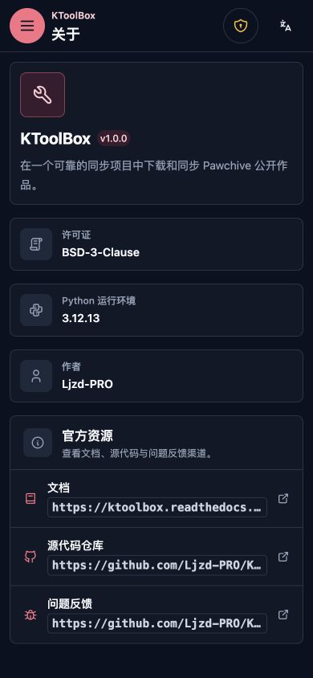
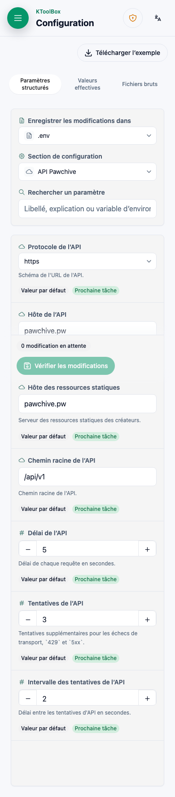
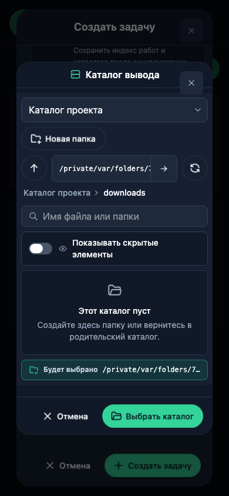

# Справочник по развёртыванию WebUI

После первоначальной безопасной настройки используйте этот справочник для эксплуатации и резервного копирования WebUI.

## О программе

Страница собирает версию, лицензию, среду выполнения и официальные ссылки. URL, IP-адреса и адреса прослушивания отображаются как встроенный код.

## Переменные окружения WebUI

| Переменная | По умолчанию | Значение |
| --- | --- | --- |
| `KTOOLBOX_WEBUI__HOST` | `0.0.0.0` | Интерфейс прослушивания. |
| `KTOOLBOX_WEBUI__PORT` | `8789` | Порт от 1 до 65535. |
| `KTOOLBOX_WEBUI__OPEN_BROWSER` | `True` | Открыть локальный URL после запуска. |
| `KTOOLBOX_WEBUI__USERNAME` | пусто → `admin` при запуске | Необязательное имя единственного аккаунта. |
| `KTOOLBOX_WEBUI__PASSWORD_HASH` | пусто | Предпочтительный постоянный хеш Argon2id. |
| `KTOOLBOX_WEBUI__PASSWORD` | пусто → случайный при каждом запуске | Открытый запасной пароль, игнорируется при хеше. |
| `KTOOLBOX_WEBUI__MAX_ACTIVE_TASKS` | `2` | Параллельные верхние задачи, 1–16. |
| `KTOOLBOX_WEBUI__SESSION_IDLE_HOURS` | `24` | Срок сеанса с последнего использования. |
| `KTOOLBOX_WEBUI__SESSION_ABSOLUTE_HOURS` | `168` | Максимальный срок с момента входа. |

Если важна история задач, резервируйте `ktoolbox.toml`, локальные dotenv и `.ktoolbox/webui.sqlite3` вместе. Не копируйте базу во время работы WebUI.

## Многоязычная проверка в браузере

Все семь каталогов реально проверяются на компьютере и мобильном экране в светлой и тёмной темах. Ниже показаны прошедшие проверку примеры; пользовательские данные и пути файловой системы сохраняют исходный текст.

## Связанные руководства WebUI

- [Установка и безопасность](../webui.md)
- [Сценарии проекта](project-workflows.md)
- [Задачи и обновления](tasks.md)
- [Справочник развёртывания](reference.md)
