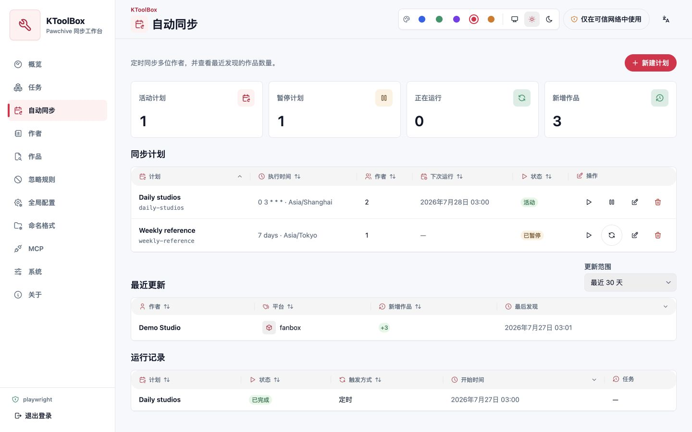

# 自動同步

「**自動同步**」頁面會依排程重用現有作者同步流程。每次執行都會建立一般同步任務，因此仍可在「**任務**」查看進度、失敗原因、暫停、停止與日誌。

## 建立計畫

1. 先將作者加入目前專案的作者清單。
2. 開啟「**自動同步**」，選擇「**新增計畫**」。
3. 勾選一位或多位作者。
4. 選擇標準五段 Cron 計畫，或不少於 15 分鐘的固定間隔。
5. 選擇 IANA 時區，並核對未來三次執行時間。
6. 選擇首次檢查日期與同步選項，然後儲存。

圖形設定支援每小時、每天、每週和每月等常見排程；進階設定可輸入標準五段表達式。固定間隔使用穩定錨點，「**立即執行**」不會改變下一次自動執行時間。

## 檢查點與最近更新

每次執行開始前會固定截止時間。KToolBox 從上次成功檢查點向前重疊 24 小時，並依平台、作者 ID 與作品 ID 去重。

- 成功作者會推進自己的檢查點。
- 失敗作者保留舊檢查點，其他成功作者仍正常推進。
- 首次選擇「**不限起始日期**」只建立基準，不把全部歷史作品計為新增。
- 「**立即執行**」與排程執行使用同一檢查點。
- 最近更新只顯示作者與新增作品數量，不載入標題或媒體。

## 暫停、衝突與停機

暫停計畫只阻止未來自動觸發，不會停止目前任務；暫停後仍可手動執行。同一計畫已有活動任務時，排程觸發會記錄為略過，「立即執行」會連結至現有任務。

KToolBox 停止期間錯過的執行不會補跑；重新啟動後會計算第一個未來時間。
