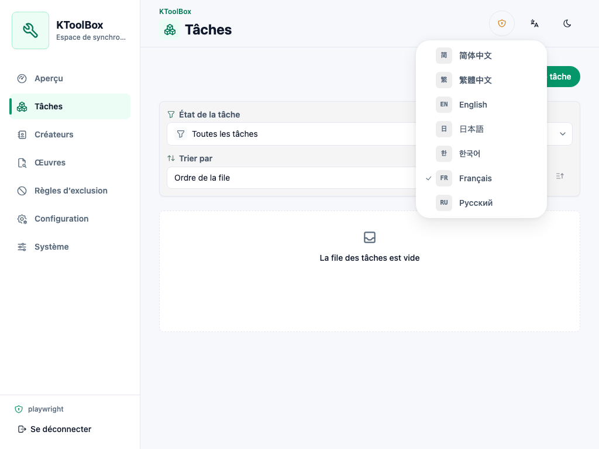
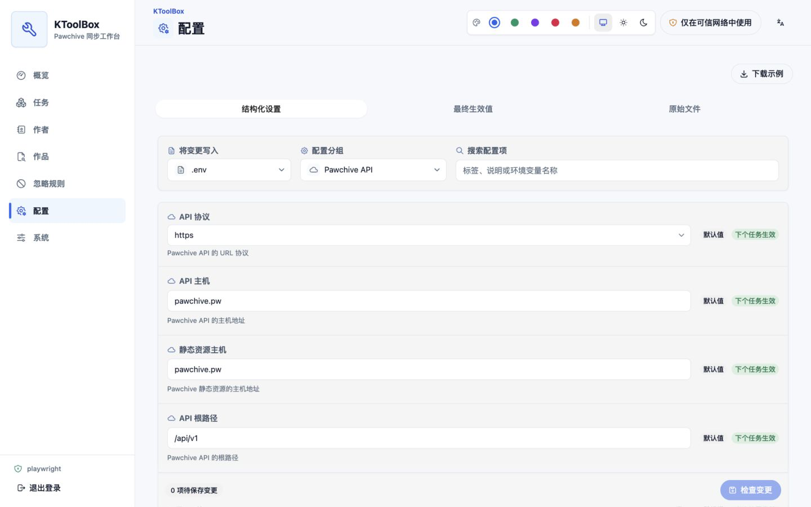
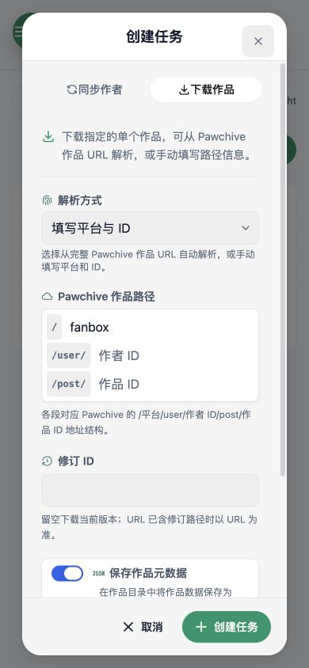
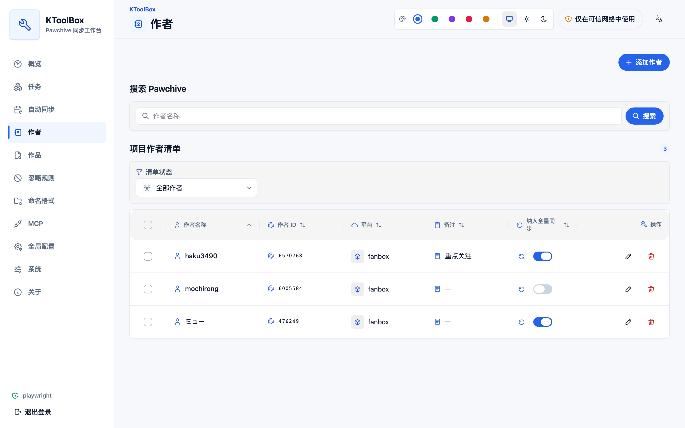
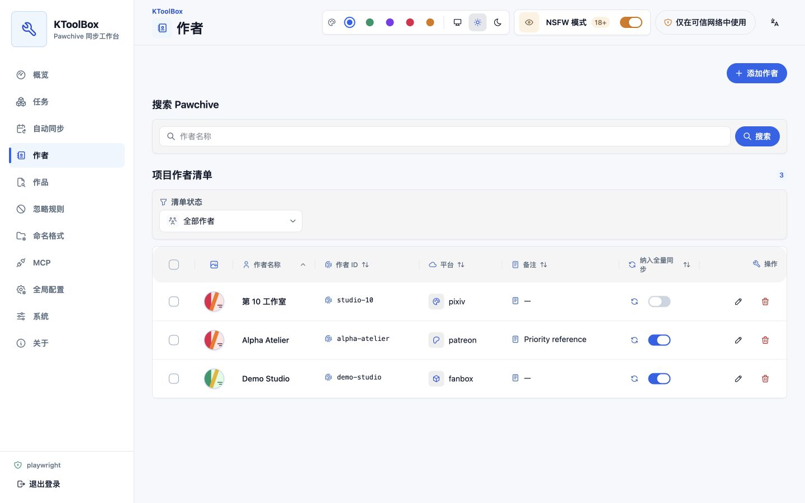
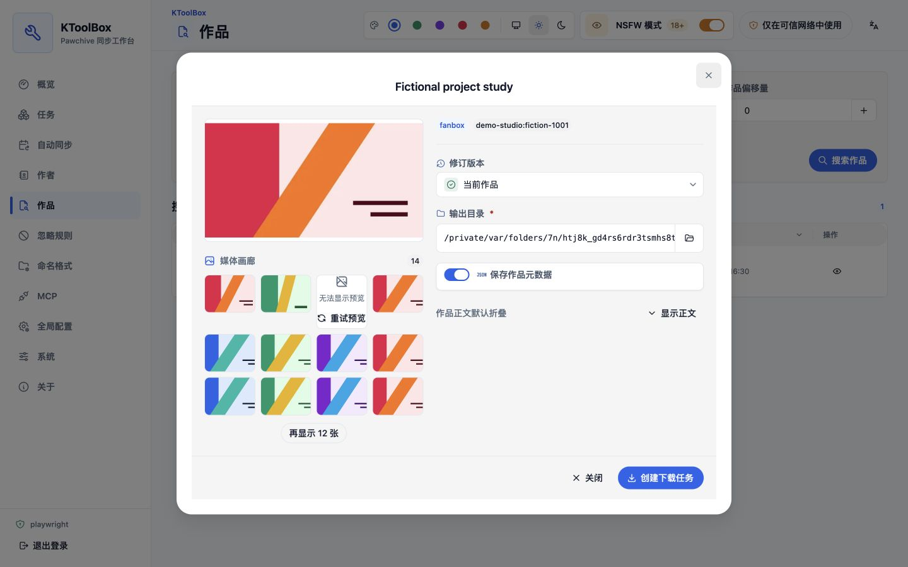
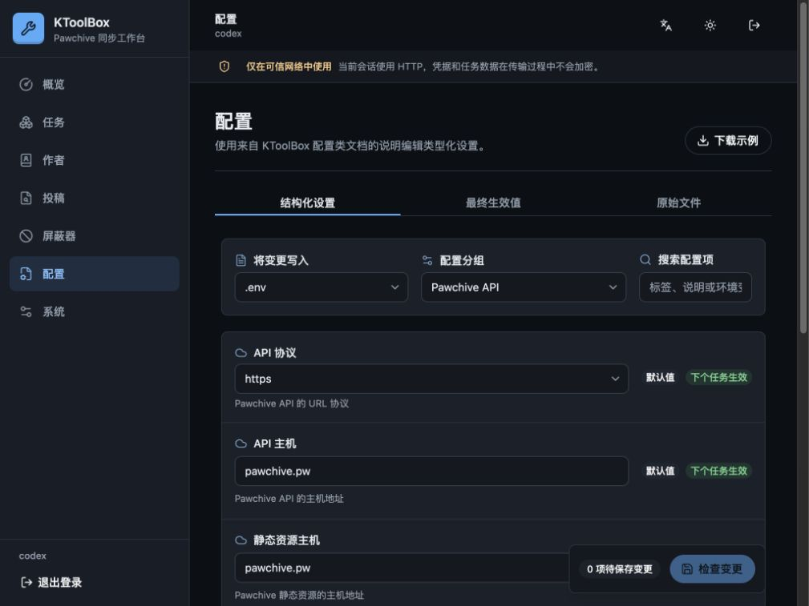
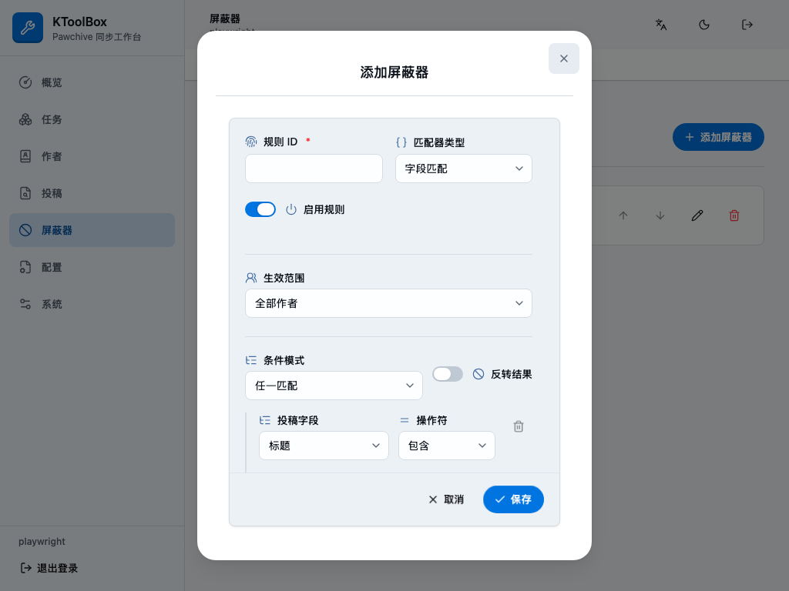

# WebUI 專案工作流程

WebUI 安裝並繫結專案後，可透過本頁管理專案資料與設定；任務執行及部署資訊分別收錄於專門指南。

## 專案工作流程

介面在第一次使用時跟隨瀏覽器語言，並支援持久選擇簡體中文、繁體中文、英語、日語、韓語、法語或俄語。切換語言時，React Aria 日期、數字格式、自然排序、設定中繼資料、表單驗證和已知伺服器錯誤會一併更新。主題在選擇淺色或深色前會跟隨作業系統。可選藍色、翠綠、紫色、玫瑰色與琥珀色重點色；表單開關啟用時固定為藍色，以在不同色盤間保持一致狀態。桌面使用精簡側邊欄，窄螢幕使用 Drawer。

可編輯區域使用柔和的次要表面，欄位背景清楚分隔。欄位圖示便於掃視；表單開關與核取方塊會和標籤靠左對齊，不會看起來像置中的操作按鈕。開關關閉時軌道為灰色，開啟時為藍色；核取方塊只在選取或不確定時顯示指示。可編輯對話框內容與固定操作列共用連續表面。

主要區域包括：

- **概覽：**專案路徑、佇列健康狀態、作用中傳輸總量與最近工作。
- **工作：**建立、編輯、暫停、繼續、停止、重新執行、刪除和查看同步或單篇下載，也可選取多項執行相容的批次操作。只有可讀工作目標連結會開啟詳細資料，操作控制項不會誤觸導覽。
- **自動同步：**建立多個定期創作者同步計畫、查看最近更新數量與執行歷史、暫停計畫或立即執行。
- **創作者：**搜尋 Pawchive，並新增、編輯備註、啟用、停用或移除清單項目，支援批次啟用、停用與移除。
- **作品：**搜尋作品、查看修訂並建立下載工作；只有明確開啟 NSFW 模式後才顯示圖片預覽，正文仍預設收合。
- **忽略規則：**排序並限定 `field-match` 規則的作用域，組合巢狀 `any`/`all`、包含、等於、規則運算式與存在條件。
- **全域設定：**透過型別化表單或進階文字檢視編輯 `.env`、`prod.env` 和 `ktoolbox.toml`。
- **系統：**查看專案與應用程式版本，並下載範例環境檔案。
- **關於：**查看 KToolBox 版本、授權、執行環境、作者、文件、原始碼儲存庫與問題回報入口，不顯示作者電子郵件。

建立工作使用兩個固定分頁，不會出現多餘的滾動控制項。同步日期保留為官方 HeroUI 的單一 `year/month/day - year/month/day` 範圍欄位，「不限開始日期」與「不限結束日期」可分別清除任一邊界。作品偏移量以 50 為步長。標題篩選使用可刪除的 HeroUI Chip，輸入逗號或 Enter 即可新增。單篇作品下載與新增創作者使用獨立的 HeroUI 欄位，並以程式碼樣式的 Pawchive 路徑片段（例如 `/platform/user/creator/post/post`）分隔，不會將分隔符模擬成輸入欄位。

桌面表格與行動條目都以創作者 ID 作為主要識別資訊。選填備註會另行顯示，不會取代創作者 ID。編輯現有創作者時，平台與創作者 ID 仍可見但為唯讀，因為兩者共同識別清單項目。

## 可選敏感媒體預覽

每個新瀏覽器中的 NSFW 模式都預設關閉。關閉時作者與作品頁面維持純文字，不會發出圖片請求，也不會保留媒體空白。每次開啟都必須確認；開啟後狀態會保存在目前瀏覽器並跨分頁同步，直到使用者主動關閉。

瀏覽器只透過已登入驗證的 WebUI 同源代理取得媒體，不會直接連線 Pawchive 檔案主機。代理會完整解碼並驗證點陣圖，拒絕重新導向、SVG、非圖片、損毀檔案，以及超過 32 MiB 或 50 MP 的資源，並產生有界縮圖。開啟後可顯示作者頭像與橫幅、作品封面、圖片附件和支援的正文圖片；圖庫每次載入 12 張，檢視器支援方向鍵與 Escape。影片、壓縮檔與其他附件仍維持純文字。

## 自動同步

「自動同步」頁面支援多個計畫、選取多位創作者、五欄 Cron，以及最短 15 分鐘且具有固定錨點的間隔計畫。每個計畫包含 IANA 時區、首次執行邊界、輸出選項與未來三次執行預覽。立即執行會重用同一工作佇列，成功的創作者會推進檢查點，但不會改變間隔計畫原有時間軸。

自動檢查優先使用 Pawchive 具有 UTC 語意的 `added` 時間，並在上次成功檢查點前重疊 24 小時；專案層級去重可避免多個計畫重複統計同一作品。首次不限日期執行只建立基準，不會把全部歷史作品列為新增。KToolBox 停止期間錯過的執行會被略過，同一計畫已有作用中工作時也不會重複觸發。請參閱[自動同步指南](../automatic-sync.md)了解排程、檢查點與復原細節。

## 專案命名

命名設定與預設輸出位置儲存在專案 `ktoolbox.toml`，由 CLI、WebUI、MCP、作品下載與自動同步共用。「命名格式」頁分別儲存目錄結構與範本；可重複使用的舊目錄轉換器支援多選已儲存格式或貼上舊 `.env`/TOML，固定以目前專案格式作為唯讀目標且不持久化貼上原文。它只掃描使用者明確選取的位置，不連線 Pawchive，並支援暫停、繼續或復原。舊位置絕不會成為未來工作的下載目錄。繼承規則、舊設定遷移精靈與復原細節請參閱[命名格式指南](../naming.md)。

## 設定編輯

表單標籤與說明使用明確的本地化文字，而非 Python 識別碼。英語設定類別的 `:ivar field:` docstring 仍是欄位語意來源；經完整性檢查的語言目錄為七種語言提供全部標籤與說明，而 Pydantic 提供型別、預設值、範圍與機密中繼資料。

記錄層級等固定選項使用帶圖示的 HeroUI Select；具建議值但允許自訂的欄位使用 ComboBox。`attachments`、`content.txt`、`external_links.txt` 等作品內部名稱維持一般文字輸入，只有真正的檔案系統位置才顯示路徑選擇器。

`.env` 和 `prod.env` 分頁會顯示每個最終有效值與來源 Chip。由處理程序環境覆寫的值為唯讀。機密值預設遮蔽。進階文字編輯會顯示額外警告，因為它可能揭露機密。

以檔案系統為基礎的欄位仍可手動編輯，並新增瀏覽按鈕。對話框顯示的是執行 KToolBox 的遠端電腦，而非瀏覽器裝置，並提供已本地化的快速位置、麵包屑、搜尋、具清楚標籤的隱藏項目開關、分頁、獨立的新建目錄對話框，以及經確認的空目錄刪除。選取後，專案相對設定值仍保持相對路徑；工作與作品的絕對輸出路徑仍保持絕對。由環境來源覆寫的唯讀值無法開啟選擇器。

儲存前，伺服器會解析並驗證建議檔案，然後傳回語意差異。儲存使用 ETag 拒絕過期編輯，並以原子方式取代檔案。TOML 編輯器使用現有 TomlKit/Pydantic 儲存，因此結構化清單與忽略規則變更後仍保留註解。

## 相關 WebUI 指南

- [安裝與安全概覽](../webui.md)
- [專案工作流程](project-workflows.md)
- [任務與即時更新](tasks.md)
- [部署參考](reference.md)
