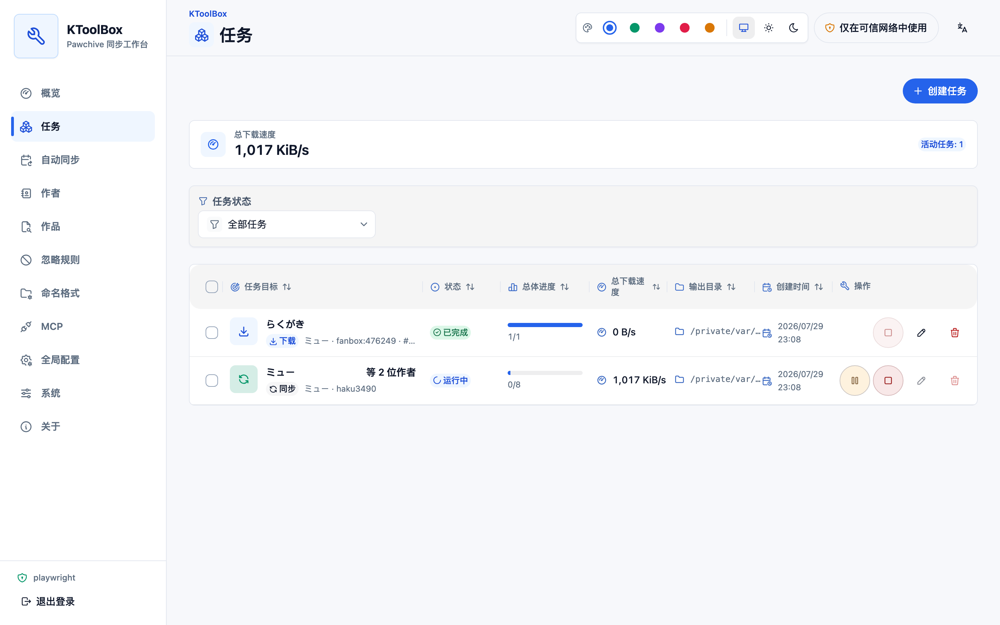
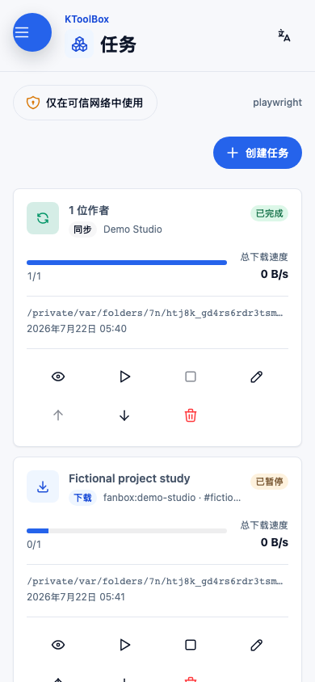
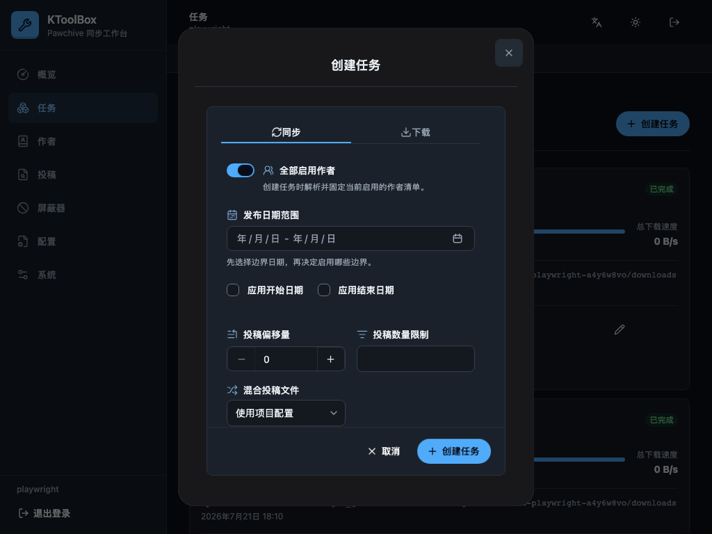
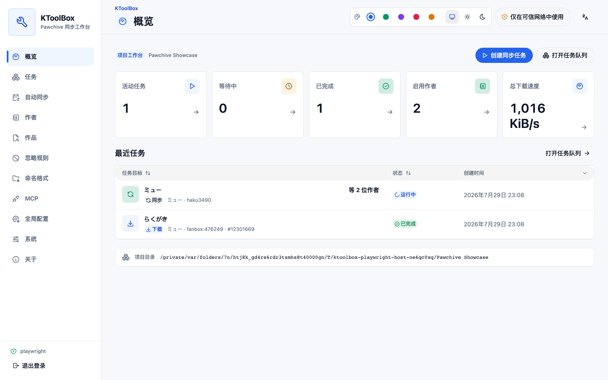
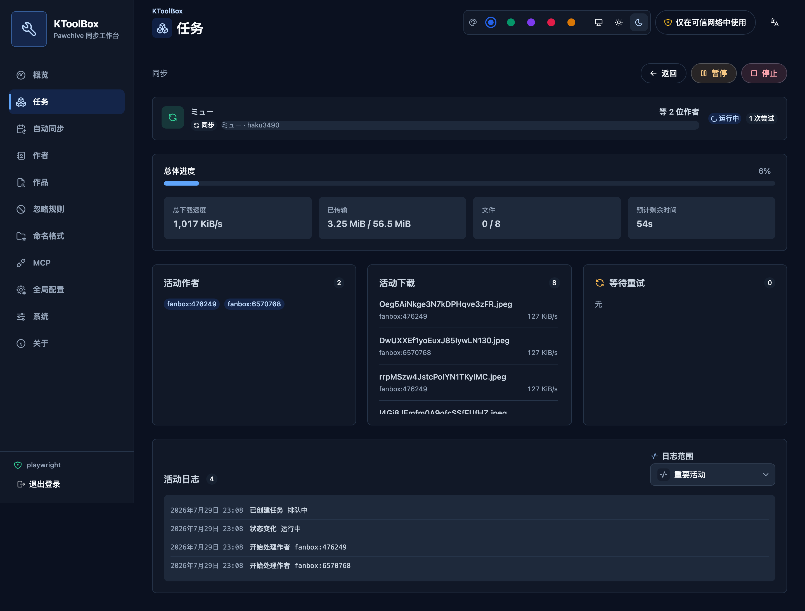
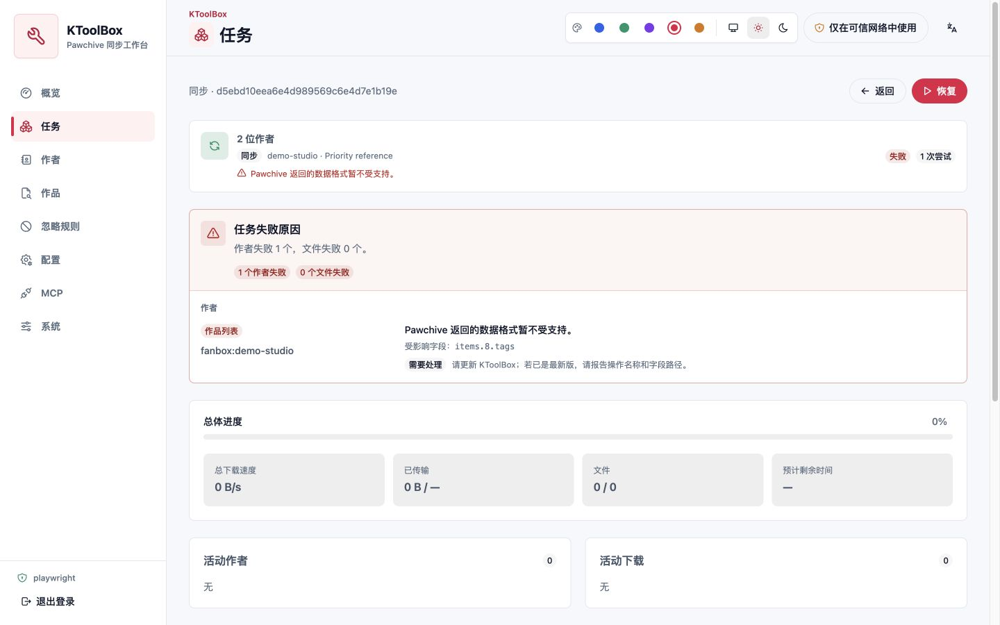
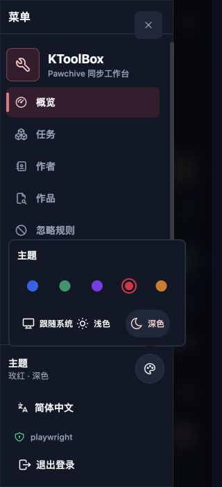
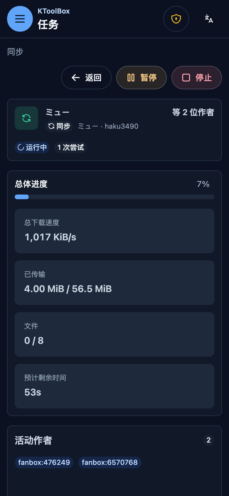
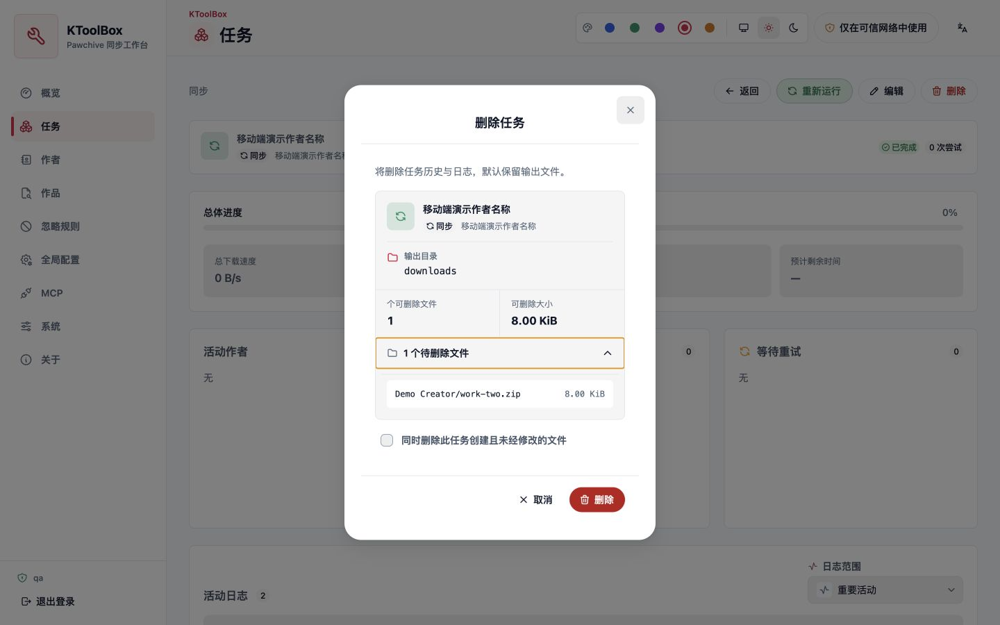
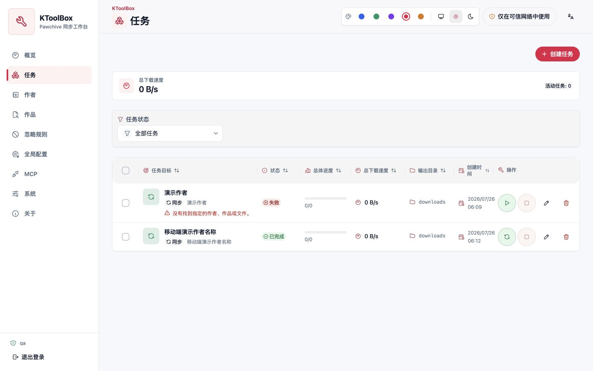

# WebUI 任務與即時更新

持久佇列統一保存任務定義、嘗試、進度、診斷與檔案擁有權記錄。本頁說明執行控制與即時同步。

## 工作生命週期

`sync` 和 `download` 工作會保留對應 CLI 的完整輸入。建立工作時，無目標同步會解析目前已啟用的清單。之後每次嘗試都會收到不可變且已遮蔽的設定快照；後續設定編輯只影響未來嘗試。

每個工作也會儲存僅用於顯示的快照，包含標準化目標金鑰以及可選的作品標題與創作者名稱。即使離線也保持可讀，永遠不影響執行、去重或資源鎖定。佇列列會優先顯示此目標而非輸出路徑，詳細資料、暫停/繼續、停止、編輯、排序與刪除控制則保持直接可見。

頂層佇列預設執行兩個工作（`KTOOLBOX_WEBUI__MAX_ACTIVE_TASKS`），每個工作仍保留所設定的創作者與檔案並行度。相同的作用中工作會解析為現有工作。標準化輸出、創作者或作品重疊的工作會在 `blocked` 中等待資源鎖釋放。

即時事件使用支援重新連線的 SSE。REST 工作狀態仍是權威來源，且只有 `task.status` 事件可變更工作狀態；單一檔案完成不會讓上層工作提早完成。總下載速度採用五秒滾動視窗與短暫的檔案交接寬限期，切換檔案時不會瞬間歸零。概覽和工作頁都會彙總真正執行中工作的速度。

詳細檢視會報告已準備創作者、檔案、位元組、總進度、總速度與單檔速度、ETA、略過/失敗數、作用中創作者、作用中下載、等待重試和結構化記錄。三個即時面板有固定高度與獨立捲動區域，並行數變化不會再推動記錄或頁面。預設活動檢視會略過位元組級進度與一般入列雜訊，需要時仍可切換到傳輸或完整診斷檢視。

失敗嘗試會持久儲存有界且已脫敏的診斷報告，不再只記錄失敗數量。工作項目直接顯示第一個有意義的原因；詳細資料依創作者與檔案分組，並標示失敗階段、是否適合重試、安全欄位路徑及建議處理方式。報告不會儲存上游回應本文、作品標題、Cookie 或完整下載 URL。窄螢幕採用 64px 頂列、12px 頁面間距和精簡外觀 Popover，在不把表單文字縮小到 16px 以下的前提下顯示更多內容；MCP 工具目錄使用可摺疊 HeroUI 群組，搜尋或權限篩選時會自動展開相符群組。

暫停採合作方式：作用中網路串流會關閉，完成檔案與可續傳暫存檔會保留，繼續會建立新嘗試。停止會保留工作定義，以便編輯和重新執行。只有已暫停、已停止、失敗或中斷的工作可以繼續；已完成同步工作改為提供「重新執行」，沿用原工作記錄並建立新嘗試，已完成單篇下載不提供此操作。處理程序重新啟動會將先前執行中的工作標記為 `interrupted`、清除殘留即時進度，且復原永遠需要明確操作。

刪除輸出前會顯示可讀工作目標、輸出目錄、檔案與位元組總數，以及可展開的相對路徑預覽；介面不顯示內部 UUID。確認後只刪除由該工作建立且未修改的一般檔案。

## 自動重新整理

登入後，應用程式只建立一個 SSE 連線，在多個瀏覽器分頁之間同步工作、創作者、忽略規則、設定、MCP 權杖和目前開啟的遠端目錄。結構變更通常會在 1 秒內顯示；工作進度會直接更新本機查詢快取，不會反覆下載完整工作清單。

即時連線超過 5 秒無法使用時，WebUI 會顯示精簡警告，並每 10 秒重新整理本機專案資料；SSE 恢復後會立即停止降級輪詢並統一重新整理一次。Pawchive 搜尋、作品詳細資料和版本檢查始終按需執行，不會由降級輪詢觸發。

系統頁會顯示目前更新方式與最後訊號時間，並提供立即重新整理及重新連線操作。若其他分頁或 MCP 用戶端在表單有未儲存修改時更新資料，KToolBox 會保留草稿，讓使用者選擇重新載入或繼續編輯；儲存時仍會執行既有的 ETag 與工作狀態衝突檢查。

## 相關 WebUI 指南

- [安裝與安全概覽](../webui.md)
- [專案工作流程](project-workflows.md)
- [任務與即時更新](tasks.md)
- [部署參考](reference.md)
