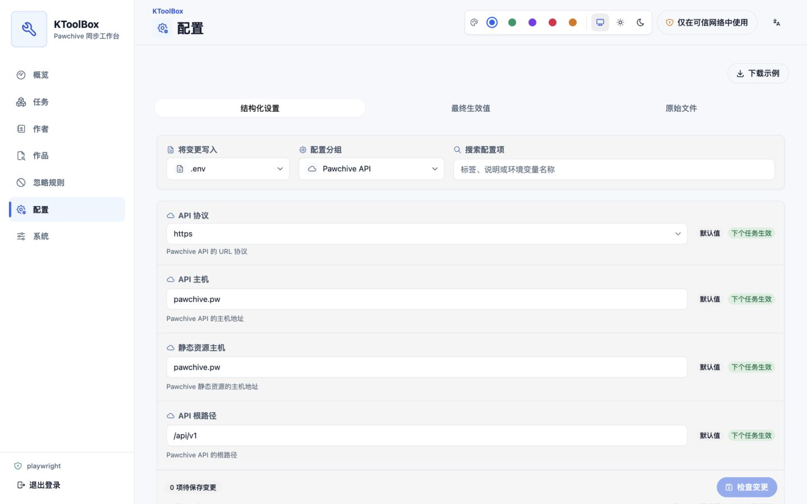
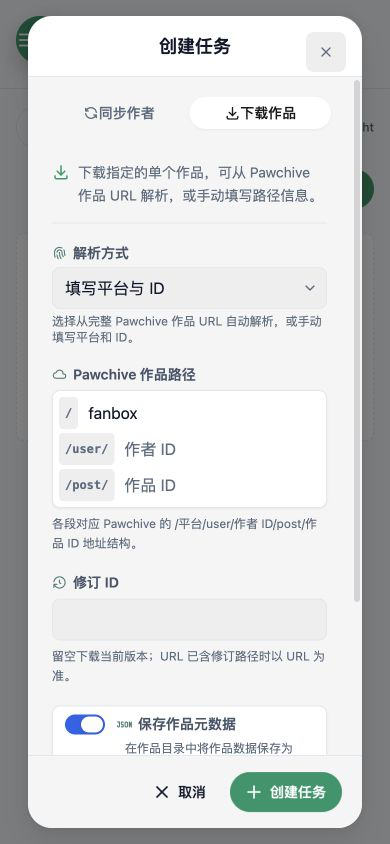
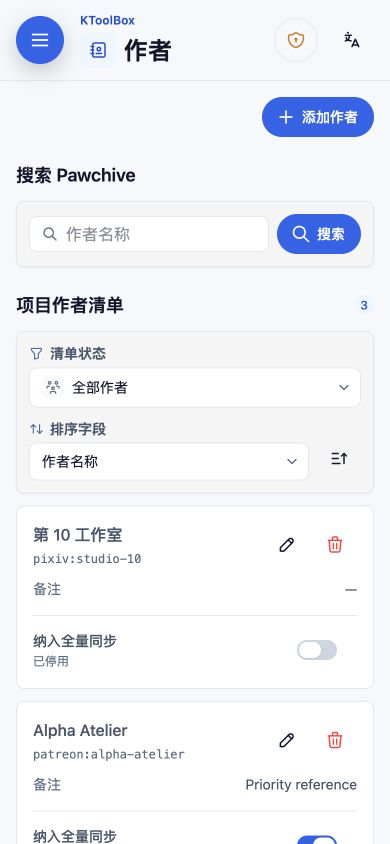
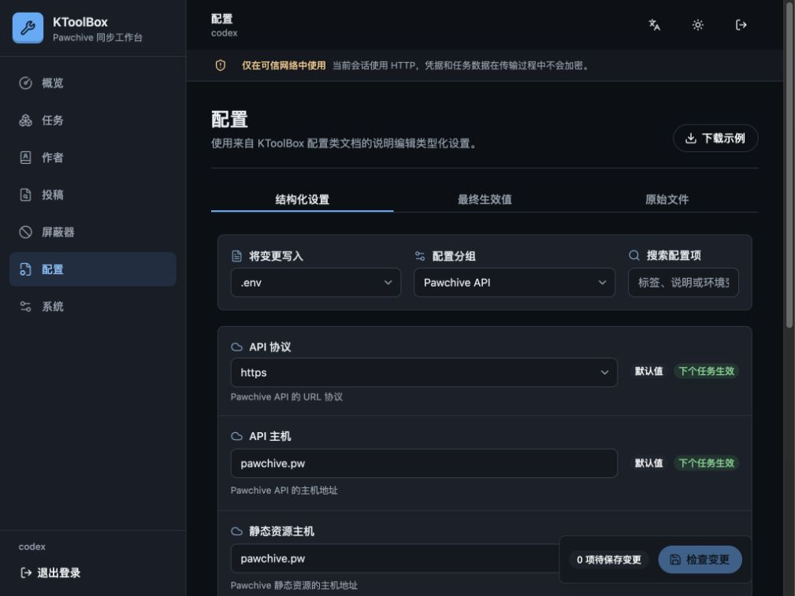
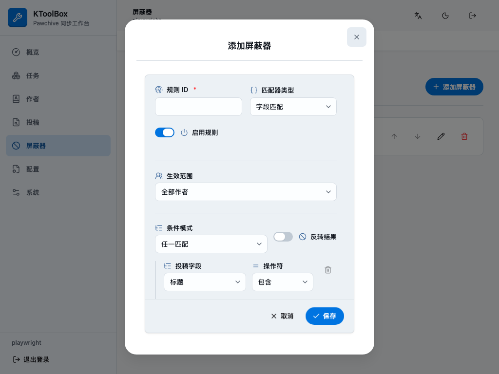
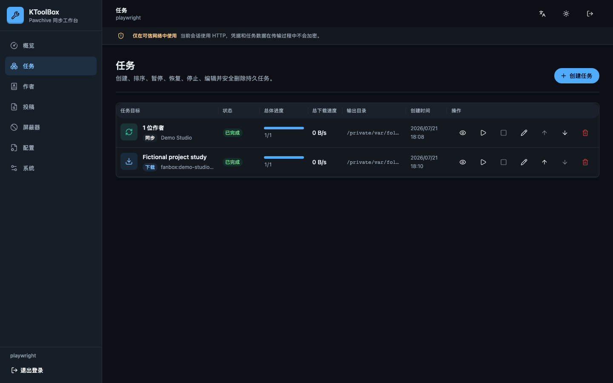
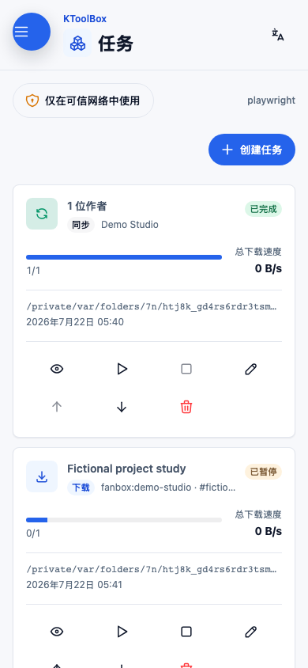
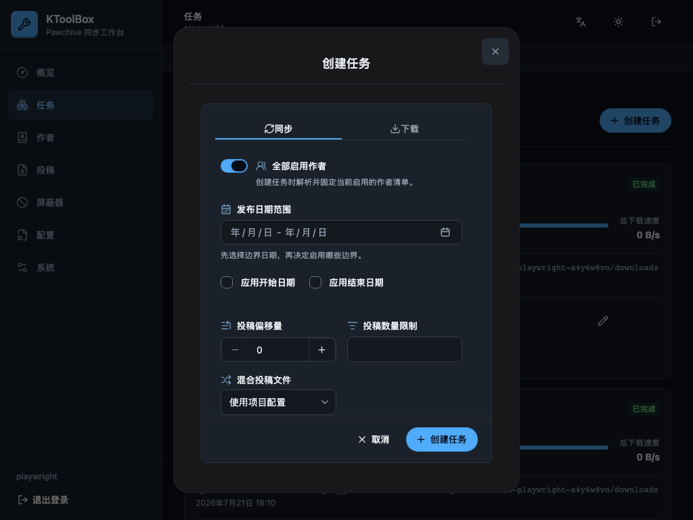
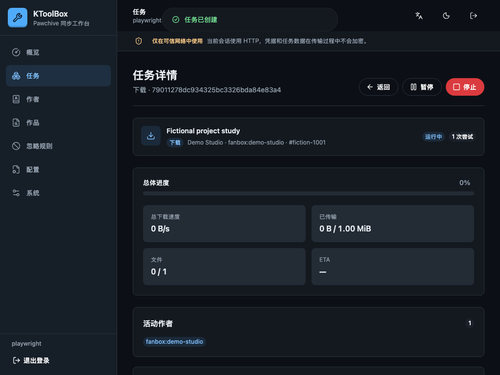

# WebUI

KToolBox WebUI 是绑定单个项目的管理面板，使用 React 与 HeroUI 构建。它与 CLI 共用配置和 Python 应用服务，不会启动或解析 CLI 子进程。任务、尝试记录、日志和输出归属保存在所选项目的 `.ktoolbox/webui.sqlite3`。

## 安装与启动

安装可选运行依赖并创建项目目录：

```bash
pipx install "ktoolbox[webui]" --force
mkdir ktoolbox-project
cd ktoolbox-project
```

启动时可以不配置凭据；未配置时，终端会输出本次进程使用的 `admin` 用户名和新随机密码。如需固定凭据，可通过隐藏终端输入生成 Argon2id 密码哈希：

```bash
ktoolbox webui hash-password
```

将账户写入项目 `.env`。请为哈希加引号，以免其中的 `$` 被当作变量：

```dotenv
KTOOLBOX_WEBUI__USERNAME=owner
KTOOLBOX_WEBUI__PASSWORD_HASH='$argon2id$v=19$...'
```

为该项目启动面板：

```bash
ktoolbox webui .
ktoolbox webui . --host 127.0.0.1 --port 8789 --no-open
```

默认监听 `0.0.0.0:8789` 并自动打开本机浏览器。`--host`、`--port`、`--no-open` 只为本次进程覆盖环境配置。缺少 `ktoolbox.toml` 时，启动过程会在终端显示警告，并以原子写入方式创建一份最小有效项目文件。缺少凭据不再阻止启动：用户名留空时使用 `admin`，两种密码均留空时为本次运行生成并在终端输出新密码。

## 安全模型

KToolBox 只提供一个本地 WebUI 账户。显式配置始终优先，`KTOOLBOX_WEBUI__PASSWORD_HASH` 又优先于兼容用的明文 `KTOOLBOX_WEBUI__PASSWORD`。两种密码均未配置时，每次启动都会在内存中生成新密码，并只在该进程的终端中连同有效用户名一起输出。稳定部署应优先配置哈希，并确保两个 dotenv 文件都不进入版本控制。

会话使用随机不透明令牌，SQLite 只保存令牌哈希。浏览器 Cookie 具有 `HttpOnly` 与 `SameSite=Strict` 属性，在 HTTPS 请求下还会增加 `Secure`。修改请求需要每个会话独立的 CSRF 令牌并接受同源检查。登录受速率限制，API 响应禁止缓存，应用还会发送严格的内容、嵌入、来源和浏览器权限安全头。

内置服务使用 HTTP。默认局域网监听仅适合可信网络，否则密码、Cookie、路径、日志和配置在传输中都可能被读取。单机使用请加 `--host 127.0.0.1`；远程使用请通过可信反向代理终止 HTTPS，并限制网络访问。当页面不是安全连接时，登录页和应用顶部会持续显示 HTTP 警告。

同一项目一次只能运行一个调度器。项目锁会阻止两个 WebUI 进程同时修改任务队列与输出。

## 项目工作流

首次访问会跟随浏览器语言，并可持久切换中文或英文。主题默认跟随系统，也可固定为浅色或深色；界面提供蓝、绿、紫、玫红和琥珀五套强调色，而表单开关在启用时始终保持蓝色，避免主题变化干扰状态识别。桌面端使用紧凑侧栏，窄屏使用 Drawer。



可编辑区域使用柔和的次级表面，输入控件具有独立的字段背景；字段图标便于快速扫描，表单开关与复选框则和标签一起靠左排列，不会表现成居中的操作按钮。开关关闭时使用灰色轨道、开启时使用蓝色轨道；复选框仅在选中或不确定状态显示标记。可编辑弹窗的内容与固定操作栏共用一张连续表面。

主要页面包括：

- **概览：** 项目路径、队列状态、活动传输统计和近期任务；每张统计卡都是可通过键盘访问的链接，可直接进入对应的任务或作者筛选视图。
- **任务：** 创建、排序、编辑、暂停、恢复、停止、重新执行、删除并查看同步或单篇下载。
- **作者：** 搜索 Pawchive，并新增、编辑备注、启停或移除清单项。
- **作品：** 不加载远程媒体、不默认展开正文地搜索作品与查看修订，并创建下载任务。
- **忽略规则：** 排序 `field-match` 规则、设置作用域，并组合嵌套 `any`/`all`、包含、等于、正则和存在条件。
- **配置：** 使用类型化表单或高级原文视图编辑 `.env`、`prod.env` 与 `ktoolbox.toml`。
- **系统：** 查看项目与应用版本，并下载环境配置示例。





创建任务使用两个固定标签，不会出现多余的滚动按钮。同步日期保留为官方 HeroUI 的单个 `year/month/day - year/month/day` 范围字段，同时允许“不限起始日期”和“不限结束日期”分别清空任一边界；作品偏移量始终以 50 为步长。标题筛选以可删除的 HeroUI Chip 展示，输入中英文逗号或回车即可添加。单个作品下载和新增作者使用独立 HeroUI 字段，并以代码样式的 `/platform/user/creator/post/post` 路径片段分隔，不再把分隔符伪装成输入控件。

平台字段使用 HeroUI ComboBox，内置 Patreon、Pixiv 与 Fanbox 建议，同时允许输入任意自定义平台。选项较少且含义明确的下拉项会显示图标；颜色只用于状态、警告和危险等真实语义。

桌面表格与移动条目均以 Pawchive Profile 返回的作者名称为主身份。名称缓存 24 小时，刷新失败时继续使用旧值；从未成功获取名称时才回退到作者 ID。备注保持独立且默认留空。编辑已有作者时，平台和作者 ID 保持可见但只读，因为两者共同标识项目清单中的条目。

概览近期任务、任务队列、作者清单和作品结果均支持受控 HeroUI 排序。文本使用支持中文与自然数字的本地化顺序，数量、进度、速度、状态和时间按真实值排序；移动卡片提供相同的排序字段与升降序控制。任务自定义排序只改变显示顺序，不会改变调度顺序；启用自定义排序时，队列移动按钮会禁用并说明原因。

## 配置编辑

表单显示明确的双语文本，而不是 Python 标识符。字段说明从中英文配置类的 `:ivar field:` docstring 提取，类型、默认值、范围和秘密属性来自 Pydantic。

`.env` 与 `prod.env` 标签会显示最终生效值及来源 Chip。被进程环境覆盖的字段只读，秘密值默认遮蔽；高级原文编辑会额外提示可能暴露秘密。

保存前，服务端会解析、校验候选文件并返回语义差异。保存使用 ETag 拒绝过期编辑，并以原子替换落盘。TOML 编辑沿用现有 TomlKit/Pydantic 存储，因此结构化修改作者与忽略规则时会保留注释。





## 任务生命周期

`sync` 与 `download` 任务覆盖对应 CLI 的完整输入。创建无目标同步时，会立即解析并保存当前已启用作者。每次尝试都会取得不可变且脱敏的配置快照，之后的配置修改只影响未来尝试。

每项任务还保存仅用于展示的快照，其中包含规范化目标键及可选作品标题、作者名；离线时仍然可读，且不会参与执行、去重或资源锁。队列条目以任务目标而非输出路径作为主体，详情、暂停/恢复、停止、编辑、排序和删除操作始终直接可见。







顶层队列默认同时运行两个任务（`KTOOLBOX_WEBUI__MAX_ACTIVE_TASKS`），每个任务内部仍保留作者和文件并发配置。完全相同的活动任务会返回现有任务；规范化输出、作者或作品资源发生重叠时，新任务进入 `blocked`，等待资源锁释放。

实时事件通过支持断线续接的 SSE 发送，REST 中的任务状态始终是最终依据。详情页显示作者准备状态、文件数、传输字节、总体进度、总速度与单文件速度、ETA、跳过/失败计数、活动项目及结构化日志。



暂停采用协作方式：关闭活动网络流，保留已完成文件和可续传临时文件；恢复会新建一次尝试。停止会保留任务定义，以便编辑后重新执行。服务进程重启后，原运行任务标记为 `interrupted`，必须由用户明确恢复。

普通删除只移除任务、尝试和日志。“同时删除输出”会先展示文件和总字节预览，确认后只删除任务记录为自己创建且未被修改的普通文件；不会跟随或删除符号链接，也不会删除既存、已修改或共享文件。

## WebUI 环境变量参考

| 变量 | 默认值 | 说明 |
| --- | --- | --- |
| `KTOOLBOX_WEBUI__HOST` | `0.0.0.0` | 监听接口。 |
| `KTOOLBOX_WEBUI__PORT` | `8789` | 监听端口，范围 1–65535。 |
| `KTOOLBOX_WEBUI__OPEN_BROWSER` | `True` | 启动后打开本机 URL。 |
| `KTOOLBOX_WEBUI__USERNAME` | 空 → 启动时为 `admin` | 可选的单账户用户名。 |
| `KTOOLBOX_WEBUI__PASSWORD_HASH` | 空 | 推荐的固定 Argon2id 哈希。 |
| `KTOOLBOX_WEBUI__PASSWORD` | 空 → 每次启动随机生成 | 明文后备值；存在哈希时忽略。 |
| `KTOOLBOX_WEBUI__MAX_ACTIVE_TASKS` | `2` | 顶层并发任务数，范围 1–16。 |
| `KTOOLBOX_WEBUI__SESSION_IDLE_HOURS` | `24` | 距最后一次使用的会话期限。 |
| `KTOOLBOX_WEBUI__SESSION_ABSOLUTE_HOURS` | `168` | 距登录时间的会话最长期限。 |

任务历史需要备份时，请一起备份 `ktoolbox.toml`、本地 dotenv 文件与 `.ktoolbox/webui.sqlite3`；不要在 WebUI 运行期间复制数据库。
